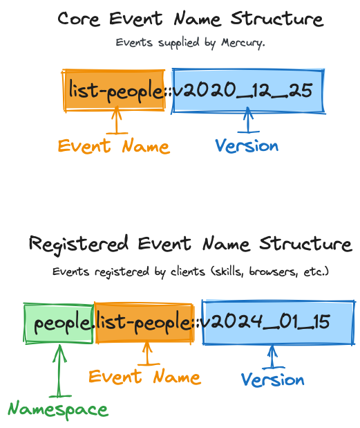
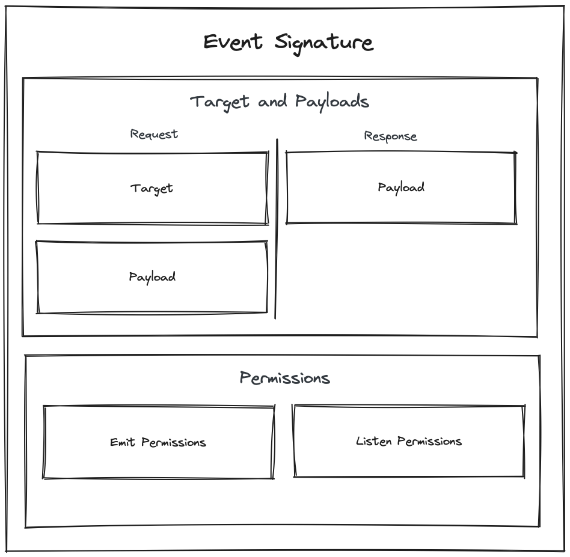

# Events

Events are the primary way to interact with any client connected to Mercury (skills, browsers, apps, Raspberry Pi's, etc.).

There are 2 categories of events in the platform:

1. **Core events**. These are built into Mercury. No setup or install required (but you may not have permission to use them).
2. **Registered events**: These are custom events that skills define and register.

Given our ideological stance of ["Small Trunk, Big Branches"](../../ideology/architecture/), most of the functionality you in your `Theatre` will be provided by registered events.

## Types of events

There are 3 types of events:

1. **Command**: These events are commands to a client to do something. These are similary to HTTP POST/GET/PUT/DELETE requests in behavior.
2. **Reactive**: These are to signify something happened somewhere in the platform. They well start with the word `did-`. Example: `did-login`, `appointments.did-book-appointment`.
3. **Preemptive**: These are to signify something is about to happen. They will start with the word `will-`. Example: `will-login`, `appointments.will-book-appointment`. This is a common place to cancel a command.


## Anatomy of an Event's Name

There are 3 parts to an event's name:

1. **Namespace**: This is the namespace of the skill or client that registered the event. Core events do not have a namespace. When a skill is registered with Mercury, it will get to choose its namespace.
2. **Event Name**: The event name is the name of the event being sent. It is followed by a `::`.
3. **Version**: The version is the version of the event being sent. It is the last part of the event's name.

An event that is comprised of all 3 parts is called a **Fully Qualified Event Name**.

&nbsp;

<div style="text-align:center">
    
</div>

## Anatomy of an Event

Events are very robust, especially when compared to standard verb based HTTP requests (and even other event based systems). 

1. **Targets & Payloads**
    1. **Emit Target**: This is where the event is going. It can be a skill, a location, a person, or something totally custom that your skill introduces.
    2. **Emit Payload**: This is the data that is being sent with the event.
    3. **Response Payload**: This is the data that is returned from a listener that handled the event.
2. **Permissions**
    1. **Emit Permissions**: These are the permissions required to emit the event. By default, the skill that registered the event is the only one that can emit it.
    2. **Listener Permissions**: These are the permissions required to listen to the event. By default, the skill that registered the event is the only one that can listen to it.


<div style="text-align:center">
    
</div>

## Event File Structure

When you register an event as a skill (see ["Registering an Event"](#registering-an-event) below), the following files will be created:

```
>ls src/events/{eventName}/v2024_01_01

emitPayload.builder.ts
emitTarget.builder.ts
event.options.ts
responsePayload.builder.ts

```

**Files**:

1. **emitPayload.builder.ts**: The schema of the payload that is sent when the event is emitted.
2. **emitTarget.builder.ts**: The schema of the target that the event is being sent to.
3. **event.options.ts**: Additional options for an event (including permissions).
4. **responsePayload.builder.ts**: The schema of the payload that is returned when the event is handled.

## Events & Faked Listeners

### Registering an Event

Here is a quick breakdown on how to register an event. You won't go about it this way in most circumstances, but it'll get down to the fundamentals on how it works.

> **Note**: In order to register an event, you'll first need to [register your skill with Mercury](/concepts/mercury/#registering-your-skill).

<details>
<summary><strong>Test 1a</strong>: Create your test</summary>

Run the following code in your skill's root directory:

```bash
spruce create.test
```
</details>

<details>
<summary><strong>Test 1b</strong>: Emit your event</summary>

Your event has not been defined yet, but we need a failing test to get there!

```ts
import { AbstractSpruceFixtureTest } from '@sprucelabs/spruce-test-fixtures'
import { test, fake } from '@sprucelabs/test-utils'
import { vcAssert } from '@sprucelabs/heartwood-view-controllers'

@fake.login()
export default class RenderingADialogTest extends AbstractSpruceFixtureTest {

    @test()
    protected static async rendersAlertOnLoad() {
        await this.fakeClient.emitAndFlattenResponses('my-skill::book-appointment::v1')
    }
}
```

> **Note**: Do not worry about getting the version right. We'll fix it after we define the event.

</details>

<details>
<summary><strong>Production 1a</strong>: Create your event</summary>

Run the following code in your skill's root directory:

```bash 
spruce create.event
```

</details>

<details>
<summary><strong>Production 1b</strong>: Define your event</summary>

Now is a great time to do some event design work. Finde Once your event is defined, make sure you run the following:

```bash
spruce sync.events
```

</details>


### Something Missing?

<div class="grid-buttons">
    <a class="btn" href="https://forms.gle/2ZMtwUxg1egV8sHT8">Request Documentation Enhancement</a>
</div>