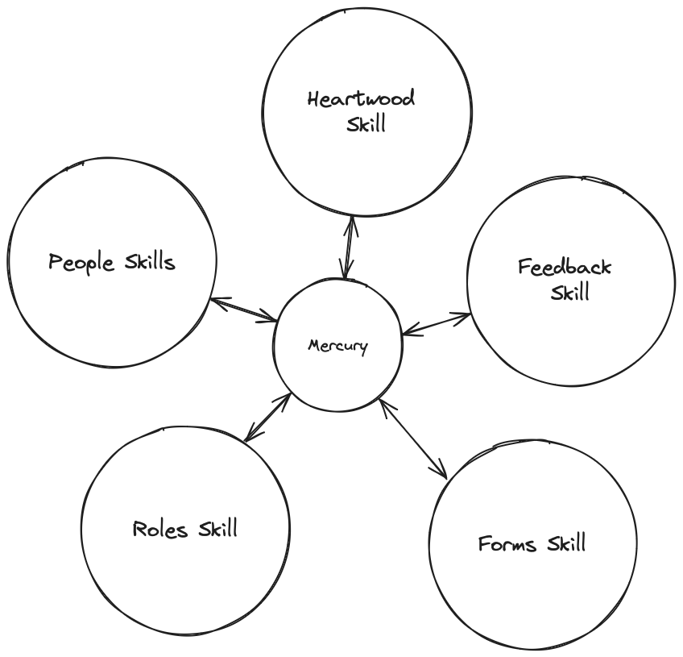
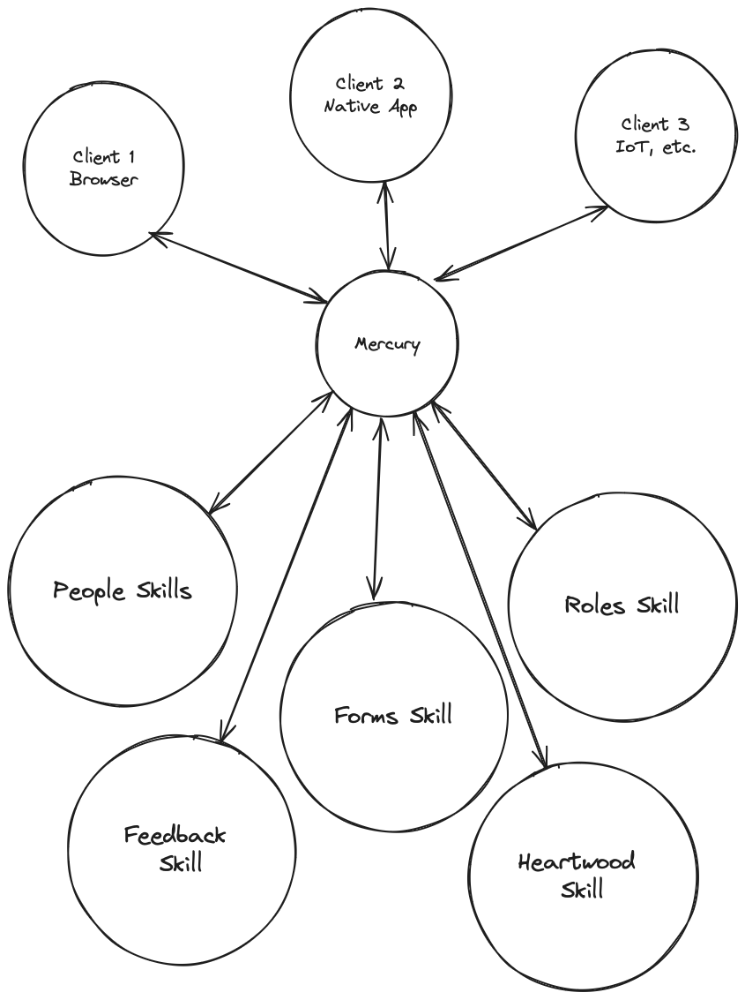

# Mercury

`Mercury` is the "event bus" that facilitates the communication between clients (skills, browsers, Iot, etc). When clients communicate, they are always having their events routed through `Mercury`. It also comes with suite of events to support some core functionality you'de expect from any foundational platform (people & role management, permissions, messages, etc).

## Skills and Mercury


Every skill utilizes the `MercuryClient` for communication. It's a websocket based client that facilitates both push and pull type communication (typical event driven systems stuff). If a skill wants to, it'll go through Mercury. One outcome of this is that skills can be indepedently upgrade, updated, and rebooted without affecting the rest of the system.





## Clients, Skills, and Mercury

 Even "non-skill clients", like browsers, native apps, or any device that can run a `MercuryClient` will have it's communication routed through `Mercury`. In this example if, "Client 1" and "Client 2" wanted to communicate, they'd still have to go through `Mercury`. 



## Core Events

It's common to refer to the events that `Mercury` supports as "core events". 

API COMING SOON

### Registering your skill

In order for your skill to officially be a "skill," you need to register it. Once registered, it'll be able to register events, be installed at organizations, and more.

```bash
spruce register
```

### Something Missing?

<div class="grid-buttons">
    <a class="btn" href="https://forms.gle/2ZMtwUxg1egV8sHT8">Request Documentation Enhancement</a>
</div>