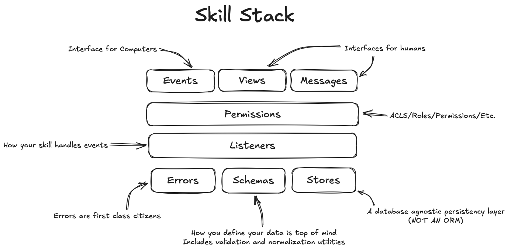

# Skills

A `Skill` is a descrete piece of functionality that includes the full stack of an application. It's a way to encapsulate a feature or set of features in a way that can be easily installed, updated, removed, etc.



## Skill Lifecycle

To start, your `Skill` is only a `BootLoader` that looks for `Features`. `Features` map closely to the `Concepts`. Your `Skill` starts with no `Features` installed and the `SpruceCLI` installs them for you as you need them.


## Folder Structure

| Folder        | Purpose     |
|---------------|-----------------|
| `.spruce`     | Coming soon...  |
| `config`      | Coming soon...  |
| `logs`        | Coming soon...  |
| `tests`       | Coming soon...  |

## Creating your Skill

When you're ready to start building a new `Skill`, you can use the [`SpruceCLI`](../spruce-cli/) to generate the `Skill` scaffolding. 

```bash
spruce create skill [directory]
``` 

> **Note:** If you don't provide a directory, the `Skill` will be created in the current directory.

## Booting your Skill

If you want to boot your `Skill` in a local environment, you can use the `boot` command.

```bash
spruce boot
```

## Registering your skill

If your skill uses an `Events`, `Listeners` or `Views`, you'll need to register it with `Mercury`.

```bash
spruce register
```

> **Note:** You will need to log into your personal account to register your skill. You can login using `spruce login`.

## Listening to Skill Boot Events

The `Event Feature` allows you to listen to 2 events that are emitted during the boot process:

1. `will-boot` - Fired ASAP when the skill is booted.
2. `did-boot` - Fired after all features have booted.

You can add your listener by running:

```bash
spruce create.listener
```

