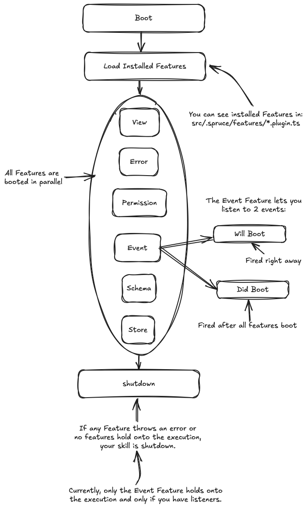

# Skills

A `Skill` is a descrete piece of functionality that includes the full stack of an application. It's a way to encapsulate a feature or set of features that can easily be deployed, installed, updated, configured, removed, etc.


## Skill Lifecycle

To start, your `Skill` is only a `BootLoader` that looks for `Features`. `Features` map closely to the `Concepts`. Your `Skill` starts with no `Features` and the [`SpruceCLI`](/concepts/spruce-cli/) installs them for you as you need them.



## Folder Structure

| Folder        | Purpose     |
|---------------|-----------------|
| `.vscode`     | Coming soon...  |
| `build`     | Coming soon...  |
| `node_modules`       | Coming soon...  |
| `src`       | Coming soon...  |
| `src/__tests__`       | Coming soon...  |
| `src/.spruce`       | Coming soon...  |
| `src/errors`       | Coming soon...  |
| `src/listeners`       | Coming soon...  |
| `src/permissions`       | Coming soon...  |
| `src/schemas`       | Coming soon...  |
| `src/skillViewControllers`       | Coming soon...  |
| `src/stores`       | Coming soon...  |
| `src/viewControllers`       | Coming soon...  |
| `src/viewPlugins`       | Coming soon...  |
| `.editorconfig`       | Coming soon...  |
| `.eslintcache`       | Coming soon...  |
| `.npmignore`       | Coming soon...  |
| `.nvmrc`       | Coming soon...  |
| `.eslint.config.mjs`       | Coming soon...  |
| `package.json`       | Coming soon...  |
| `README.md`       | Coming soon...  |
| `tsconfig.json`       | Coming soon...  |

## Creating your Skill

When you're ready to start building a new `Skill`, you can use the [`SpruceCLI`](../spruce-cli/) to generate the `Skill` scaffolding. 

```bash
spruce create.skill [directory]
``` 

> **Note:** If you don't provide a directory, the `Skill` will be created in the current directory.

## Booting your Skill

If you want to boot your `Skill` in a local environment, you can use the `boot` command.

```bash
spruce boot
```

## Registering your skill

If your skill uses an `Events`, `Listeners` or `Views`, you'll need to register it with `Mercury`.

```bash
spruce register
```

> **Note:** You will need to log into your personal account to register your skill. You can login using `spruce login`.

## Listening to Skill Boot Events

The `Event Feature` allows you to listen to 2 events that are emitted during the boot process:

1. `will-boot` - Fired ASAP when the skill is booted.
2. `did-boot` - Fired after all features have booted.

You can add your listener by running:

```bash
spruce create.listener
```

