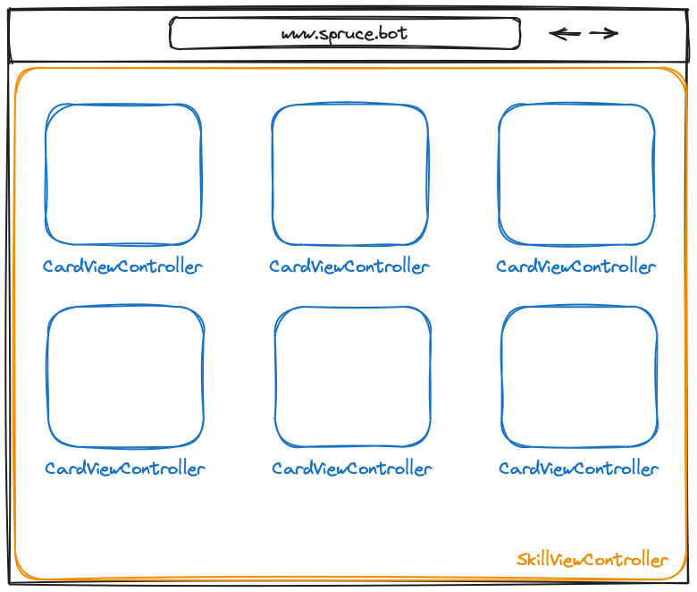
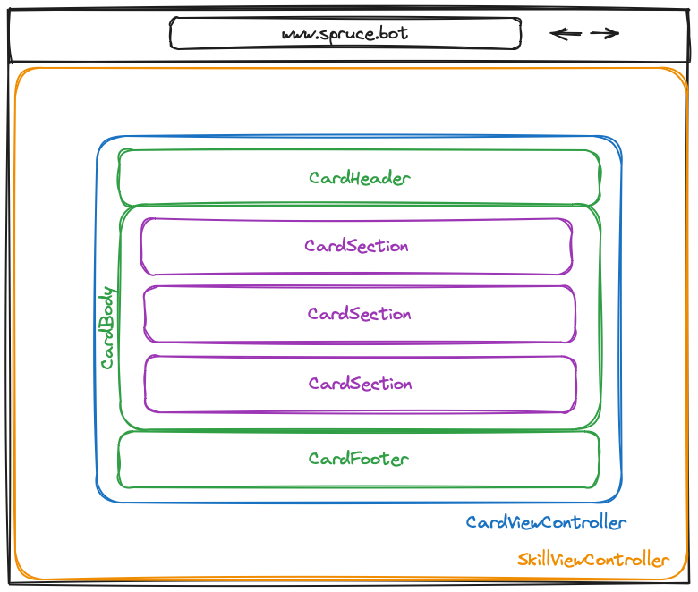

# Views

`Views` are the building blocks of the front-end experience in Spruce. Every `Skill` can register `Skill Views` that are comprised of `CardViewControllers`. By default, the a skill's `RootSkillViewController` is the first view that is rendered.



A `CardViewController` has a `CardHeader`, `CardBody`, and `CardFooter`. The `CardBody` is comprised of many `CardSections`. See the diagrams below to understand how cards are constructed.



Every other type of `ViewController` (listed below) is rendered inside a `CardSection`. This allows for a consistent look and feel across all views in the Spruce ecosystem.

## Important Classes

<details>

<summary><strong>AbstractCalendarEventViewController</strong> - The class that calendar events extend to customize how they render in the calendar.</summary>

Coming soon...

</details>

<details>

<summary><strong>AbstractSkillViewController</strong> - The class your Skill Views can extend to have access to helpful properties.</summary>

Coming soon...

</details>

<details>

<summary><strong>AbstractViewController</strong> - The class your views can extend to have access to helpful properties.</summary>

Coming soon...

</details>

<details>

<summary><strong>ActiveRecordCardViewController</strong> - A card that holds an `ActiveRecordList` to make loading, searching, and paging through database records a breeze.</summary>

[Storybook](https://storybook.spruce.bot/?path=/story/components-lists--active-record-list)

</details>

<details>

<summary><strong>ActiveRecordListViewController</strong> - A list that makes loading, searching, and paging through database record a breeze.</summary>

[Storybook](https://storybook.spruce.bot/?path=/story/components-lists--active-record-list)

</details>

<details>
<summary><strong>AutocompleteInputViewController</strong> - Turns a text input into an autocomplete input.</summary>

Coming soon...
</details>

<details>
<summary><strong>BigFormViewController</strong> - A form that renders one field at a time with customizable transitions between questions.</summary>

[Storybook](https://storybook.spruce.bot/?path=/story/components-big-form--big-form).
</details>

<details>
<summary><strong>ButtonBarViewController</strong> - A strip of buttons that supports selection and deselection.</summary>

[Storybook](https://storybook.spruce.bot/?path=/story/components-buttons--button-bar).
</details>

<details>
<summary><strong>ButtonGroupViewController</strong> - An array of buttons that supports selected and deselected states.</summary>

[Storybook](https://storybook.spruce.bot/?path=/story/components-buttons--single-select-group).
</details>

<details>
<summary><strong>CalendarViewController</strong> - A calendar that supports day and month views (more soon)!</summary>

[Storybook](https://storybook.spruce.bot/?path=/story/components-calendar--day-calendar).
</details>

<details>
<summary><strong>CalendarEventViewController</strong> - The view controller that renders for each event by detail!</summary>

[Storybook](https://storybook.spruce.bot/?path=/story/components-calendar--day-calendar).
</details>

<details>
<summary><strong>CardViewController</strong> - The building block of every Skill View!</summary>

[Storybook](https://storybook.spruce.bot/?path=/story/components-cards--cards).
</details>

<details>
<summary><strong>CountdownTimerViewController</strong> - A flipboard style countdown timer!</summary>

[Storybook](https://storybook.spruce.bot/?path=/story/components--countdown).
</details>

<details>
<summary><strong>FeedViewController</strong> - A chat component for handling coversations!</summary>

[Storybook](https://storybook.spruce.bot/?path=/story/components-the-feed--the-feed).
</details>

<details>
<summary><strong>FormBuilderViewController</strong> - A component for building custom forms!</summary>

[Storybook](https://storybook.spruce.bot/?path=/story/components-form-builder--form-builder).
</details>

<details>
<summary><strong>FormViewController</strong> - A form comprised of inputs (or a list with inputs)!</summary>

[Storybook](https://storybook.spruce.bot/?path=/story/components-form--all-field-types).
</details>

<details>
<summary><strong>ListCellViewController</strong> - The cells that build a row.</summary>

[Storybook](https://storybook.spruce.bot/?path=/story/components-lists--with-controller).
</details>

<details>
<summary><strong>ListRowViewController</strong> - Rows that build a list.</summary>

[Storybook](https://storybook.spruce.bot/?path=/story/components-lists--with-controller).
</details>

<details>
<summary><strong>ListViewController</strong> - A List based on rows and cells.</summary>

[Storybook](https://storybook.spruce.bot/?path=/story/components-lists--with-controller).
</details>

<details>
<summary><strong>MapViewController</strong> - A customizable map with pin and navigation support.</summary>

[Storybook](https://storybook.spruce.bot/?path=/story/components-lists--with-controller).
</details>

<details>
<summary><strong>NavigationViewController</strong> - Customize the navigation. Currently render inside the ControlBar.</summary>

[Storybook](https://storybook.spruce.bot/?path=/story/components-nav--control-bar).
</details>

<details>
<summary><strong>PolarAreaViewController</strong> - A polar area chart.</summary>

[Storybook](https://storybook.spruce.bot/?path=/story/components-reporting--polar-area).
</details>

<details>
<summary><strong>ProgressNavigatorViewController</strong> - Renders at the top of the screen to track progress through any process.</summary>

[Storybook](https://storybook.spruce.bot/?path=/story/components--progress-navigation).
</details>

<details>
<summary><strong>ProgressViewController</strong> - A progress indicator with an optional message.</summary>

[Storybook](https://storybook.spruce.bot/?path=/story/components-reporting--progress-as-grid-in-big-left).
</details>

<details>
<summary><strong>RatingsViewController</strong> - A ratings component to gauge sentiment or against a scale.</summary>

[Storybook](https://storybook.spruce.bot/?path=/story/components-form--customizable-ratings).
</details>

<details>
<summary><strong>SwipeViewController</strong> - A version of a card where sections are rendered as a swipe view.</summary>

[Storybook](https://storybook.spruce.bot/?path=/story/components-swipe--swipe).
</details>

<details>
<summary><strong>StatsViewController</strong> - Render numbers with labels with some nice animations.</summary>

[Storybook](https://storybook.spruce.bot/?path=/story/components-swipe--swipe).
</details>

<details>
<summary><strong>TalkingSprucebotViewController</strong> - Sprucebot animation with typing text. Great for storytelling!</summary>

[Storybook](https://storybook.spruce.bot/?path=/story/components-talking-sprucebot--talking-sprucebot).
</details>

<details>
<summary><strong>ToolBeltViewController</strong> - Holds an extra set of cards that hide when not in use!</summary>

[Storybook](https://storybook.spruce.bot/?path=/story/components-tool-belt-tool-belt--tool-belt).
</details>

## Rendering Your First Skill View

Let's get started on rendering your first `SkillView` and `CardViewController`.

<details>
<summary><strong>Test 1</strong>: Load Your Root Skill View</summary>

We'll start with the `RootSkillViewController`. All you have to do to start is try and load your Skill View and the test will fail.

```ts
@test()
protected static async canLoadRootSkillView() {
    this.views.Controller('eightbitstories.root', {}),
}
```

</details>

<details>
<summary><strong>Production 1</strong>: Create Your Root Skill View</summary>

This part is pretty easy! Run this following command and follow the instructions!

```shell
spruce create.view
```
</details>

## View Controller Plugins

You can globally enhance View Controller functionality by using View Controller Plugins. Here are some plugins that are already available:

1. [AutoLogoutPlugin](https://www.npmjs.com/package/@sprucelabs/spruce-heartwood-utils): Automatically logs out a person after a certain period of inactivity. You can set the timeout in seconds and also disable it where desired.
2. [AdjustMmpVcPlugin](https://www.npmjs.com/package/@sprucelabs/spruce-mmp-vc-plugin): Used to communicate with the MMP (Mobile Measurement Partners) Adjust. Others like AppsFlyer may come later. It currently only works inside the Spruce native iOS app.

### Implementing a View Controller Plugin

<details>
<summary><strong>Test 1:</strong> Assert the plugin is installed</summary>

```ts
import {
    vcAssert,
    vcPluginAssert,
} from '@sprucelabs/heartwood-view-controllers'
import { AutoLogoutPlugin } from '@sprucelabs/spruce-heartwood-utils'

@test()
protected static async autoLogoutPluginInstalled() {
    vcPluginAssert.pluginIsInstalled(
        this.views.Controller('eightbitstories.root', {}),
        'autoLogout',
        AutoLogoutPlugin
    )
}
```

> **Note**: If you are planning on using your own plugin (one that is not built yet), use it instead of `AutoLogoutPlugin` as if it exists and then begin with the productions steps below.

</details>

<details>
<summary><strong>Production 1:</strong> Install the plugin</summary>

1. Install the module that holds the plugin: `yarn add {packageName}`
2. Create the plugin: `spruce create.view.plugin`
3. Implement the plugin at `./src/viewPlugins/{pluginName}.ts`

Your plugin starts like this:

```ts
import { ViewControllerPlugin } from '@sprucelabs/heartwood-view-controllers'

export default class MyViewPlugin implements ViewControllerPlugin {
    ...
}
```

Now that plugin is created, you can import it into your test.

> **Note**: If you are using a prebuilt plugin, you would implement it like this:

```ts
export { AutoLogoutPlugin as default } from '@sprucelabs/spruce-heartwood-utils'
```

</details>

<details>
<summary><strong>Test Doubling Your Plugin</strong></summary>

You can drop in your test double using the `views` fixture on your `AbstractSpruceFixtureTest` . Here is how you may do that in your `beforeEach()`:

```ts
protected static async beforeEach() {
    await super.beforeEach()

    this.spy = new SpyPlugin()
    this.views.addPlugin('autoLogout', this.spy)
}
```

Now, in any View Controller you create, `this.plugins.autoLogout` will be the `SpyPlugin` instance.

```ts
class RootSkillView extends AbstractSkillViewController {
    public constructor(options: SkillViewControllerOptions) {
        super(options)
    }

    public async load() {
        this.plugins.autoLogout.doSomething()
    }
}
```

</details>
