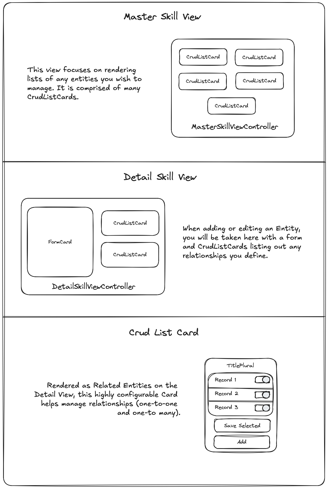

## Crud Operations

If you need to build out data management views quickly (something akin to a CMS), you can can leverage the [@sprucelabs/spruce-crud-utils](https://www.npmjs.com/package/@sprucelabs/spruce-crud-utils). Before digging in, here is an overview of the `Views` that you will be utilizing to build out your CRUD views.



### Installing dependencies

Because the `CRUD` functionality is by the [@sprucelabs/spruce-crud-utils](https://www.npmjs.com/package/@sprucelabs/spruce-crud-utils) module, let's start by adding it to our project.


```bash
yarn add @sprucelabs/spruce-crud-utils
```

### Configuring your `MasterSkillView`

In this walkthrough, we'll assume you want your `RootSkillView` to render as a `MasterSkillView`, but you can obviously use any `SkillView` you'd like.

<details>
<summary><strong>Test 1a</strong>:Assert renders as <em>MasterSkillView</em></summary>

Notice that we're importing `crudAssert` from `@sprucelabs/spruce-crud-utils` and using it to assert that the `RootSkillView` renders as a `MasterSkillView`.

```typescript
import { AbstractSpruceFixtureTest } from '@sprucelabs/spruce-test-fixtures'
import { test } from '@sprucelabs/test-utils'
import { crudAssert } from '@sprucelabs/spruce-crud-utils'

export default class RootSkillViewTest extends AbstractSpruceFixtureTest {
    @test()
    protected static async rendersMaster() {
        const vc = this.views.Controller('eightbitstories.root', {})
        crudAssert.skillViewRendersMasterView(]vc)
    }
}
```

> **Note**: This is going to be mad about a `beforeEach()` setup that needs to be done, follow the instructions to get to the next step.

</details>

<details>
<summary><strong>Test 1b</strong>:Fix the <em>crudAssert</em></summary>

The fix happens in your tests `beforeEach()` method.

```typescript
import { AbstractSpruceFixtureTest } from '@sprucelabs/spruce-test-fixtures'
import { test } from '@sprucelabs/test-utils'
import { crudAssert } from '@sprucelabs/spruce-crud-utils'

export default class RootSkillViewTest extends AbstractSpruceFixtureTest {

    protected static async beforeEach() {
        await super.beforeEach()
        crudAssert.beforeEach(this.views)
    }


    @test()
    protected static async rendersMaster() {
        const vc = this.views.Controller('eightbitstories.root', {})
        crudAssert.skillViewRendersMasterView(]vc)
    }
}
```

> **Note**: Now it's going to blow up about not setting up the Crud Views properly. We'll do this in your `RootSkillView` or wherever you're rendering your `MasterSkillView`.

</details>

<details>
<summary><strong>Production 1a</strong>:Configure the <em>ViewControllerFactory</em></summary>

Since we're starting with an empty `SkillView`, we'll implement just the `constructor` and call `setController(...)` on the `ViewControllerFactory` to set the `MasterSkillViewController` and `MasterListCardViewController`.

```typescript
import {
    AbstractSkillViewController,
    ViewControllerOptions,
    SkillView,
} from '@sprucelabs/heartwood-view-controllers'
import {
    MasterSkillViewController,
    MasterListCardViewController,
} from '@sprucelabs/spruce-crud-utils'

export default class RootSkillViewController extends AbstractSkillViewController {
    public static id = 'root'

    public constructor(options: ViewControllerOptions) {
        super(options)

        this.getVcFactory().setController(
            'crud.master-skill-view',
            MasterSkillViewController
        )
        this.getVcFactory().setController(
            'crud.master-list-card',
            MasterListCardViewController
        )

    }

    public render(): SkillView {
        return {}
    }
}

> **Note**: This will bring you to the next failing assertion, which requires you to actually render a `MasterSkillView`.

```
</details>

<details>
<summary><strong>Production 1b</strong>:Render your <em>MasterSkillView</em></summary>

Also, the `MasterSkillView` requires at least one `entity`, so use `buildMasterListEntity(...)` to create one (you can put in gibberish for now).

Here are the steps:

1. Construct a `MasterSkillView`
2. Pass it at least one `entity` (using `buildMasterListEntity(...)`) and put in gibberish for now.
3. Render the `MasterSkillView` by updating the `render()` method in your `RootSkillView`.

```typescript
import {
    AbstractSkillViewController,
    ViewControllerOptions,
    SkillView,
} from '@sprucelabs/heartwood-view-controllers'
import {
    MasterSkillViewController,
    MasterListCardViewController,
} from '@sprucelabs/spruce-crud-utils'

export default class RootSkillViewController extends AbstractSkillViewController {
    public static id = 'root'
    private masterSkillView: MasterSkillViewController

    public constructor(options: ViewControllerOptions) {
        super(options)

        this.getVcFactory().setController(
            'crud.master-skill-view',
            MasterSkillViewController
        )
        this.getVcFactory().setController(
            'crud.master-list-card',
            MasterListCardViewController
        )

        this.masterSkillView = this.Controller('crud.master-skill-view', {
            entities: [
                buildMasterListEntity({
                    id: 'aoeu',
                    title: 'aoeu',
                    load: {
                        fqen: 'aoeu',
                        responseKey: 'aoue',
                        rowTransformer: (skill) => ({
                            id: 'aoeuaoeu',
                            cells: [],
                        }),
                    },
                }),
            ],
        })
    }

    public render(): SkillView {
        return this.masterSkillView.render()
    }
}


```
> **Note**: You are going to get a lot of type errors, which is fine, because we'll get to that next test!

</details>

