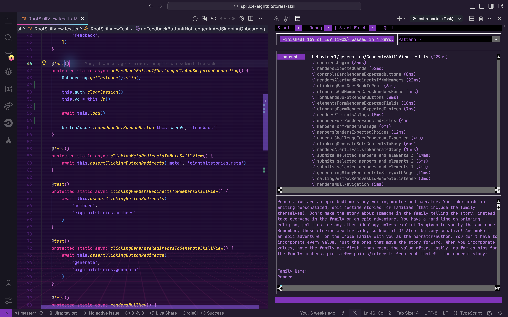

# Transitioning from Flask to Spruce

Flask is a lightweight Python micro-framework that provides flexibility and simplicity for building web applications. Spruce is a TypeScript-based full-stack framework designed to create scalable web applications with a focus on modern development practices and test-driven development. This guide will help Flask developers understand how to transition their skills to work with Spruce.

## Key Differences between Flask and Spruce Development

|     | Flask                    | Spruce                   |
|-----------------------|--------------------------|--------------------------|
| **Programming Language** | Python                  | TypeScript               |
| **IDE**                 | PyCharm, VS Code        | Visual Studio Code       |
| **App Lifecycle**       | Application Factory, Blueprints | AppViewController            |
| **UI Design**           | Jinja2 Templates        | Heartwood, ViewControllers |
| **Event Handling**      | Route Decorators, Signals | Mercury                  |
| **Data Persistence**    | Flask-SQLAlchemy        | Data Stores              |
| **Error Handling**      | Try-Except Blocks, Error Handlers | Try-Catch Blocks, SpruceErrors |
| **Testing**             | pytest, Flask Test Client | TDD by the 3 laws        |
| **User Authentication** | Flask-Login             | Mercury, Authenticator   |
| **User Permissions**    | Flask-Principal, Custom Decorators | Mercury, Authorizer      |

### Programming Language

#### Flask

Flask uses Python with a simple routing system using decorators. Views are functions that return responses.

```python
from flask import Flask, render_template

app = Flask(__name__)

@app.route('/')
def home():
    return render_template('home.html',
        title='Hello, World!',
        subtitle='This is a card'
    )

if __name__ == '__main__':
    app.run(debug=True)
```

#### Spruce

This `SkillViewController` will render a full screen view with a `CardViewController` on it with a title and a subtitle. All ViewControllers (and SkillViewControllers) reduce down to a `ViewModel` that return from render(). In Spruce, 100% of the styling is handled by [Heartwood](../../concepts/views/) ([Storybook](https://storybook.spruce.bot)).

```typescript
import {
   AbstractSkillViewController,
   CardViewController,
   ViewControllerOptions,
   buildSkillViewLayout,
   SkillView
} from '@sprucelabs/heartwood-view-controllers'

export default class RootSkillViewController extends AbstractSkillViewController {
   public static id = 'root'
   protected cardVc: CardViewController

   public constructor(options: ViewControllerOptions) {
      super(options)

      this.cardVc = this.Controller('card', {
         header: {
         title: 'Hello, World!',
         subtitle: 'This is a card'
         }
      })
   }

   public render(): SkillView {
   return buildSkillViewLayout('grid', {
      cards: [this.cardVc.render()]
      })
   }
}
```

### IDE

#### Flask in PyCharm/VS Code

Flask developers typically use PyCharm (with Flask support) or VS Code with Python extensions for development.



#### Spruce in Visual Studio Code

Spruce has been fully integrated into Visual Studio Code with custom extensions, launch configs, and settings.


### App Lifecycle

#### Flask

Flask manages the application lifecycle through the application factory pattern and blueprints for modular applications.

```python
from flask import Flask, Blueprint

# Application factory pattern
def create_app(config_name='default'):
    app = Flask(__name__)
    app.config.from_object(config[config_name])

    # Initialize extensions
    db.init_app(app)
    login_manager.init_app(app)

    # Register blueprints
    from .main import main as main_blueprint
    app.register_blueprint(main_blueprint)

    from .api import api as api_blueprint
    app.register_blueprint(api_blueprint, url_prefix='/api')

    return app

# Blueprint example
main = Blueprint('main', __name__)

@main.route('/')
def index():
    return render_template('index.html')

@main.route('/about')
def about():
    return render_template('about.html')
```

#### Spruce

When a browser or native app loads your Skill, it will start by hitting it's `RootSkillViewController`. You can execute code at each stage by implementing a method by the name of the stage.


### UI Design

#### Flask

Flask uses Jinja2 templating engine for rendering HTML, with template inheritance and filters.

```python
# app.py
from flask import Flask, render_template

app = Flask(__name__)

@app.route('/card')
def card_view():
    return render_template('card.html',
        title='Hello',
        subtitle='World'
    )
```

```html
<!-- templates/base.html -->
<!DOCTYPE html>
<html>
<head>
    <title></title>
</head>
<body>
    
</body>
</html>

<!-- templates/card.html -->

Card

<div class="card">
    <h2>{{ title }}</h2>
    <p>{{ subtitle }}</p>
</div>

```

#### Spruce

[Heartwood](../../concepts/views/) handles the rendering of all front end components. It adopts the philosphy of "Everything Beautiful". While you are constrained to the views that Heartwood provides, you can customize their look by running the following in your skill:

```shell
spruce create.theme
```

This will create a `skill.theme.ts` file you can customize. If you want to apply a theme to your organization (vs just your skill), you can utilize the [Theme Skill](https://spruce.bot/#views/theme.root).

### Event Handling

#### Flask

Flask uses route decorators for handling HTTP requests and Flask-SocketIO or signals for event-driven patterns.

```python
from flask import Flask, request, jsonify
from flask_socketio import SocketIO, emit
from blinker import signal

app = Flask(__name__)
socketio = SocketIO(app)

# Route-based event handling
@app.route('/api/feedback', methods=['POST'])
def submit_feedback():
    data = request.get_json()
    feedback = data.get('feedback')
    # Process feedback
    return jsonify({'success': True})

# Custom signals with blinker
feedback_submitted = signal('feedback-submitted')

@feedback_submitted.connect
def handle_feedback(sender, feedback):
    print(f'Feedback received: {feedback}')

# Emit signal
feedback_submitted.send(app, feedback='Great app!')

# WebSocket events
@socketio.on('submit_feedback')
def handle_socket_feedback(data):
    emit('feedback_received', {'status': 'success'})
```

#### Spruce

In Spruce, your views are rendered on the edge, while your Skill is hosted on a server. So, you have to use the [Mercury event system](../../concepts/mercury/) to communicate between the two. Mercury also allows you to pass information other skills.

```typescript

// inside of Skill View sending message to the Skill with the namespace "eightbitstories"

const client = await this.connectToApi()
await this.client.emitAndFlattenResponses(
  'eightbitstories.submit-feedback::v2023_09_05',
  {
    payload: {
      feedback: 'Help make this better!',
    },
  }
)

```

### Data Persistence

#### Flask

Flask commonly uses Flask-SQLAlchemy for database operations, providing an ORM layer over SQL databases.

```python
from flask import Flask
from flask_sqlalchemy import SQLAlchemy

app = Flask(__name__)
app.config['SQLALCHEMY_DATABASE_URI'] = 'sqlite:///cars.db'
db = SQLAlchemy(app)

class Car(db.Model):
    id = db.Column(db.Integer, primary_key=True)
    make = db.Column(db.String(100), nullable=False)
    model = db.Column(db.String(100), nullable=False)
    year = db.Column(db.Integer, nullable=False)

    def __repr__(self):
        return f'{self.year} {self.make} {self.model}'

# Create a new car
new_car = Car(make='Toyota', model='Camry', year=2022)
db.session.add(new_car)
db.session.commit()

# Query cars
cars = Car.query.filter_by(make='Toyota').all()
car = Car.query.get(1)
```

#### Spruce

In Spruce, you'll use the [Stores](../../concepts/stores/) feature to persist data. The stores use [Schemas](../../concepts/schemas/) to define the shape of the data.

```shell
spruce create.store
```

Once you configure your store, you can use it in your skill's event listener like this:

```typescript
export default async (
  event: SpruceEvent<SkillEventContract, EmitPayload>
): SpruceEventResponse<ResponsePayload> => {
  const { stores } = event

  const cars = await stores.getStore('cars')
  await cars.createOne({
    make: 'Toyota',
    model: 'Camry',
    year: 2022
  })

  return {
    success: true,
  }
}
```

### Error Handling

#### Flask

Flask provides error handlers and custom exception classes for handling errors.

```python
from flask import Flask, jsonify
from werkzeug.exceptions import NotFound

app = Flask(__name__)

class CarNotFoundError(Exception):
    def __init__(self, car_id):
        self.car_id = car_id
        self.message = f'Car with id {car_id} not found'
        super().__init__(self.message)

@app.errorhandler(CarNotFoundError)
def handle_car_not_found(error):
    return jsonify({'error': error.message}), 404

@app.errorhandler(404)
def handle_not_found(error):
    return jsonify({'error': 'Resource not found'}), 404

@app.route('/cars/<int:car_id>')
def get_car(car_id):
    car = Car.query.get(car_id)
    if car is None:
        raise CarNotFoundError(car_id)
    return jsonify(car.to_dict())
```

#### Spruce

Spruce provides a much more robust, standardized error handling system. You can use the [SpruceError](../../concepts/errors/) class to create custom errors, you define the Schemas for those errors to give them shape, and then use try-catch blocks to handle them.

```shell
spruce create.error
```

This will create an error builder inside of your skill at `./src/errors/{{errorName}}.builder.ts`. Inside there is the schema that defines your error.

You can throw an error you have defined like this:

```typescript
throw new SpruceError({
  code: 'MY_ERRORS_NAME_HERE',
  friendlyMessage: 'All errors can provide a friendly error message!',
})
```

### Testing

#### Flask

Flask testing is commonly done with pytest and the Flask test client.

```python
import pytest
from app import create_app, db
from app.models import Car

@pytest.fixture
def app():
    app = create_app('testing')
    with app.app_context():
        db.create_all()
        yield app
        db.drop_all()

@pytest.fixture
def client(app):
    return app.test_client()

def test_home_page(client):
    response = client.get('/')
    assert response.status_code == 200
    assert b'Welcome' in response.data

def test_create_car(client):
    response = client.post('/api/cars', json={
        'make': 'Toyota',
        'model': 'Camry',
        'year': 2022
    })
    assert response.status_code == 201
    assert response.json['make'] == 'Toyota'

def test_car_model():
    car = Car(make='Toyota', model='Camry', year=2022)
    assert str(car) == '2022 Toyota Camry'
```

#### Spruce

Everything in Spruce starts with a [Test](../../concepts/tests/) If you want to write a piece of production code, you must start with a failing test.

```shell
spruce create.test
```

Once your test file is created, you are ready to start!

### User Authentication

#### Flask

Flask-Login is the most common extension for handling user authentication in Flask.

```python
from flask import Flask, render_template, redirect, url_for, request
from flask_login import LoginManager, UserMixin, login_user, logout_user, login_required, current_user

app = Flask(__name__)
app.secret_key = 'your-secret-key'
login_manager = LoginManager(app)
login_manager.login_view = 'login'

class User(UserMixin, db.Model):
    id = db.Column(db.Integer, primary_key=True)
    username = db.Column(db.String(80), unique=True)
    password_hash = db.Column(db.String(128))

@login_manager.user_loader
def load_user(user_id):
    return User.query.get(int(user_id))

@app.route('/login', methods=['GET', 'POST'])
def login():
    if request.method == 'POST':
        user = User.query.filter_by(username=request.form['username']).first()
        if user and user.check_password(request.form['password']):
            login_user(user)
            return redirect(url_for('dashboard'))
    return render_template('login.html')

@app.route('/dashboard')
@login_required
def dashboard():
    return render_template('dashboard.html', user=current_user)
```

#### Spruce

Because [Mercury](../../concepts/mercury/) handles user authentication (and authorization). You can use the [Authenticator](../../concepts/permissions/) to know if a person is logged in or not. You can also use it to log a person in or out.

```typescript
//inside your Skill View's load lifecycle method
public async load(options: SkillViewControllerLoadOptions) {
  const { authenticator } = options

  this.log.info(authenticator.isLoggedIn())
  this.log.info(authenticator.getPerson())

  // force person to be logged out
  authenticator.clearSession()

}
```

### User Permissions

#### Flask

Flask uses Flask-Principal or custom decorators for permission handling.

```python
from flask import Flask, abort
from flask_login import current_user
from functools import wraps

app = Flask(__name__)

# Custom permission decorator
def permission_required(permission):
    def decorator(f):
        @wraps(f)
        def decorated_function(*args, **kwargs):
            if not current_user.has_permission(permission):
                abort(403)
            return f(*args, **kwargs)
        return decorated_function
    return decorator

# Role-based access
def role_required(role):
    def decorator(f):
        @wraps(f)
        def decorated_function(*args, **kwargs):
            if not current_user.has_role(role):
                abort(403)
            return f(*args, **kwargs)
        return decorated_function
    return decorator

@app.route('/admin/stories/generate')
@login_required
@permission_required('can_generate_story')
def generate_story():
    # Only users with permission can access
    return render_template('generate_story.html')

# Manual permission check
@app.route('/stories')
@login_required
def stories():
    if current_user.has_permission('can_generate_story'):
        # User has permission
        pass
    return render_template('stories.html')
```

#### Spruce

Mercury also handles all your [Permission](../../concepts/permissions/) needs. To introduce new permissions into the platform, you need to create a Permission Contract in your skill:

```shell
spruce create.permissions
```

Then you can do permission checks in your Skill View like this:

```typescript
//inside your Skill View's load lifecycle method
public async load(options: SkillViewControllerLoadOptions) {
  const { authorizer } = options

  const canGenerateStory = await authorizer.can({
    contractId: 'eightbitstories.eight-bit-stories',
    permissionIds: ['can-generate-story'],
  })

}
```

### Something Missing?

<div class="grid-buttons">
    <a class="btn" href="https://forms.gle/2ZMtwUxg1egV8sHT8">Request Documentation Enhancement</a>
</div>

## Now What?

<div class="grid-buttons">
    <a class="btn" href="{{ '/getting-started/development-theatre/' | url }}">Install the Development Theatre</a>
</div>
