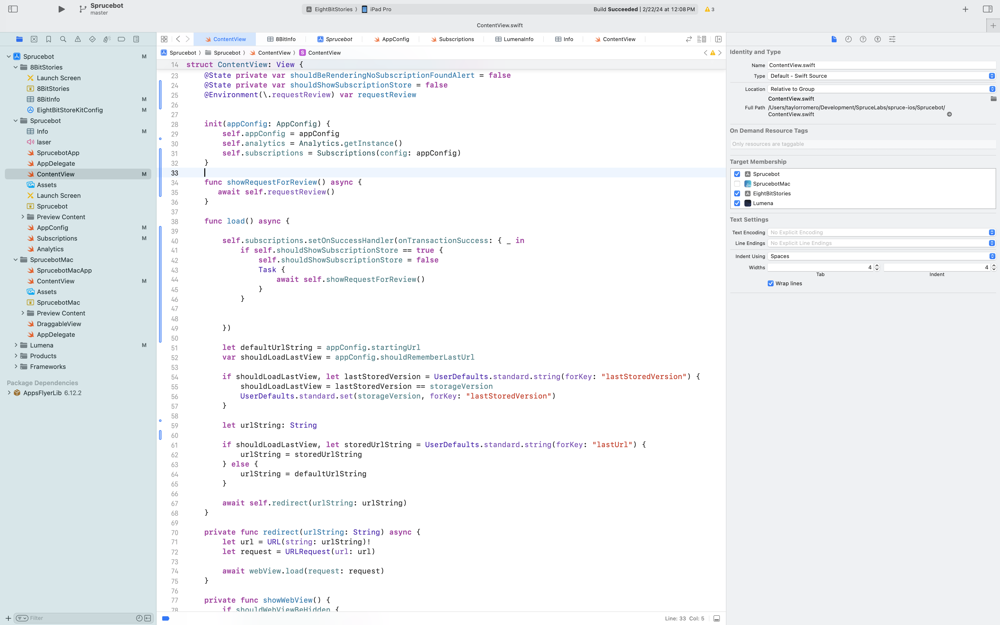
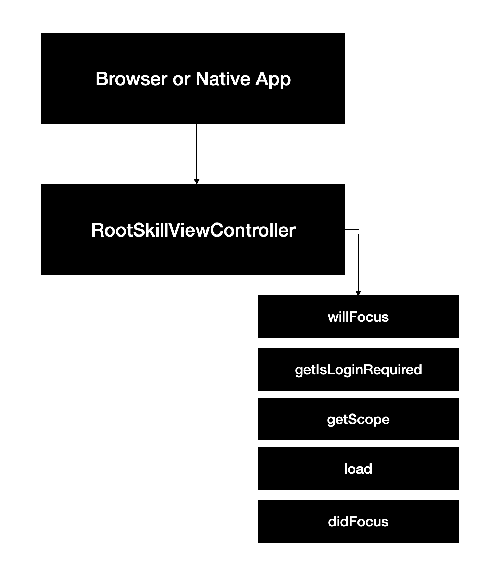

# Transitioning from iOS

iOS development typically involves Swift or Objective C, while Spruce is a TypeScript-based platform.

While iOS focuses on front-end and does support directly implementing some backend type functionality, most times an iOS app is communicating with a remote API to do it's work. Spruce, on the other hand, is a "full-stack platform" that allows for both beautiful UI's and robust back-ends.

This guide will help you connect your knowledge of iOS development to Spruce's architecture, showing you how to adapt your existing skills to the Spruce environment.

## Key Differences between iOS and Spruce Development

|     | iOS                      | Spruce                   |
|-----------------------|--------------------------|--------------------------|
| **Programming Language** | Swift/Objective-C        | TypeScript               |
| **IDE**                 | Xcode                    | Visual Studio Code       |
| **App Lifecycle**                 | AppDelegate                    | No Equivalent       |
| **UI Design**           | SwiftUI, ViewControllers            | Heartwood, ViewControllers |
| **Event Handling**      | Delegates, NotificationCenter, Target-Action | Mercury |
| **Data Persistence**    | Core Data, UserDefaults  | Data Stores                   |
| **Error Handling**      | NSError, Error Protocol, Try-Catch Blocks | Try-Catch Blocks, SpruceErrors |
| **Testing**             | XCTest                   | TDD by the 3 laws              |
| **User Authentication** | Apple's Frameworks, Custom Server-Side Solutions | Mercury, Authenticator |
| **User Permissions** | Apple's Frameworks, Custom Server-Side Solutions | Mercury, Authorizor |

### Programming Language

#### iOS

In iOS, SwiftUI view files declare a structure and a preview. The structure conforms to the View protocol and describes the view’s content and layout.

```swift
import SwiftUI

struct ContentView: View {
    var body: some View {
        VStack {
            Text("Knock, knock!")
                .padding()
                .background(Color.teal, in: RoundedRectangle(cornerRadius: 8))
            Text("Who's there?")
                .padding()
                .background(Color.yellow, in: RoundedRectangle(cornerRadius: 8))
        }
        .padding()
    }
}


```

#### Spruce

This `SkillViewController` will render a full screen view with a `CardViewController` on it with a title and a subtitle. All ViewControllers (and SkillViewControllers) reduce down to a `ViewModel` that return from render(). In Spruce, 100% of the styling is handled by [Heartwood](../../concepts/views/) ([Storybook](https://storybook.spruce.bot)).

```typescript
import {
   AbstractSkillViewController,
   CardViewController,
   ViewControllerOptions,
   buildSkillViewLayout,
   SkillView
} from '@sprucelabs/heartwood-view-controllers'

export default class RootSkillViewController extends AbstractSkillViewController {
   public static id = 'root'
   protected cardVc: CardViewController

   public constructor(options: ViewControllerOptions) {
      super(options)

      this.cardVc = this.Controller('card', {
         header: {
         title: 'Hello, World!',
         subtitle: 'This is a card'
         }
      })
   }

   public render(): SkillView {
   return buildSkillViewLayout('grid', {
      cards: [this.cardVc.render()]
      })
   }
}
```

### IDE

#### iOS in xcode



#### Spruce in Visual Studio Code


### App Lifecycle

#### iOS

#### Spruce

When a browser or native app loads your Skill, it will start by hitting it's `RootSkillViewController`. You can execute code at each stage by implementing a method by the name of the stage.



### UI Design

#### iOS

You can customize the look of any view in your app using the `SwiftUI` framework. You can use a wide variety of views to construct your interface, from labels and buttons to more complex views like lists, stacks, and navigation views.

#### Spruce

[Heartwood](../../concepts/views/) handles the rendering of all front end components. It adopts the philosphy of "Everything Beautiful". While you are constrained to the views that Heartwood provides, you can customize their look by running the following in your skill:

```shell
spruce create.theme
```

This will create a `skill.theme.ts` file you can customize. If you want to apply a theme to your organization (vs just your skill), you can utilize the [Theme Skill](https://spruce.bot/#views/theme.root).

### Event Handling

#### iOS

There are various ways to pass around data in iOS. You can use delegates, NotificationCenter, or target-action to handle events. But, since all your components are available in the same codebase, you can instantiate and invoke them directly.

#### Spruce

In Spruce, your views are rendered on the edge, while your Skill is hosted on a server. So, you have to use the [Mercury event system](../../concepts/mercury/) to communicate between the two. Mercury also allows you to pass information other skills.

```typescript

// inside of Skill View sending message to the Skill with the namespace "eightbitstories"

const client = await this.connectToApi()
await this.client.emitAndFlattenResponses(
  'eightbitstories.submit-feedback::v2023_09_05',
  {
    payload: {
      feedback: 'Help make this better!',
    },
  }
)

```

### Data Persistence

#### iOS

In iOS, you can use Core Data, UserDefaults, or a custom solution to persist data.

```swift
// UserDefaults
let defaults = UserDefaults.standard
defaults.set(25, forKey: "Age")

// Core Data
let appDelegate = UIApplication.shared.delegate as! AppDelegate
let context = appDelegate.persistentContainer.viewContext
let entity = NSEntityDescription.entity(forEntityName: "Car", in: context)
let newCar = NSManagedObject(entity: entity!, insertInto: context)

newUser.setValue("Toyota", forKey: "make")
newUser.setValue("Camry", forKey: "model")
newUser.setValue(2022, forKey: "year")

context.save()
```

#### Spruce

In Spruce, you'll use the [Stores](../../concepts/stores/) feature to persist data. The stores use [Schemas](../../concepts/schemas/) to define the shape of the data.

```shell
spruce create.store
```

Once you configure your store, you can use it in your skill's event listener like this:

```typescript
export default async (
  event: SpruceEvent<SkillEventContract, EmitPayload>
): SpruceEventResponse<ResponsePayload> => {
  const { stores } = event

  const cars = await stores.getStore('cars')
  await cars.createOne({
    make: 'Toyota',
    model: 'Camry',
    year: 2022
  })

  return {
    success: true,
  }
}
```

### Error Handling

#### iOS

iOS does not have a built-in error handling system. You can use NSError, Error Protocol, or do-catch blocks to handle errors.

```swift
do {
    try checkForError()
} catch {
    print("An error occurred")
}
```

#### Spruce

Spruce provides a much more robust, standardized error handling system. You can use the [SpruceError](../../concepts/errors/) class to create custom errors, you define the Schemas for those errors to give them shape, and then use try-catch blocks to handle them.

```shell
spruce create.error
```

This will create an error builder inside of your skill at `./src/errors/{{errorName}}.builder.ts`. Inside there is the schema that defines your error.

You can throw an error you have defined like this:

```typescript
throw new SpruceError({
  code: 'MY_ERRORS_NAME_HERE',
  friendlyMessage: 'All errors can provide a friendly error message!',
})
```

### Testing

#### iOS

Testing is a second class citizen in iOS development. You can use XCTest to write unit tests, but it's not as robust as other testing frameworks.

```swift
import XCTest

class MyTests: XCTestCase {
    func testExample() {
        let result = 1 + 2
        XCTAssertEqual(result, 3)
    }
}

```

#### Spruce

Everything in Spruce starts with a [Test](../../concepts/tests/) If you want to write a piece of production code, you must start with a failing test.

```shell
spruce create.test
```

Once your test file is created, you are ready to start!

### User Authentication

#### iOS

iOS does not have the concept of being "logged in". You'll need to use a 3rd party service like Firebase or Auth0 to handle user authentication.

#### Spruce

Because [Mercury](../../concepts/mercury/) handles user authentication (and authorization). You can use the [Authenticator](../../concepts/permissions/) to know if a person is logged in or not. You can also use it to log a person in or out.

```typescript
//inside your Skill View's load lifecycle method
public async load(options: SkillViewControllerLoadOptions) {
  const { authenticator } = options

  this.log.info(authenticator.isLoggedIn())
  this.log.info(authenticator.getPerson())

  // force person to be logged out
  authenticator.clearSession()

}
```

### User Permissions

#### iOS

iOS has ways to request permissions for things like location, camera, and microphone. You can use Apple's frameworks to request these permissions. As far as requesting permission to features you have built, you'll need to build a custom solution.

```swift
import AVFoundation

AVCaptureDevice.requestAccess(for: .video) { granted in
    if granted {
        print("Video access granted")
    } else {
        print("Video access denied")
    }
}

```

#### Spruce

Mercury also handles all your [Permission](path/to/permissions) needs. To introduce new permissions into the platform, you need to create a Permission Contract in your skill:

```shell
spruce create.permissions
```

Then you can do permission checks in your Skill View like this:

```typescript
//inside your Skill View's load lifecycle method
public async load(options: SkillViewControllerLoadOptions) {
  const { authorizer } = options

  const canGenerateStory = await authorizer.can({
    contractId: 'eightbitstories.eight-bit-stories',
    permissionIds: ['can-generate-story'],
  })

}
```

### Something Missing?

<div class="grid-buttons">
    <a class="btn" href="https://forms.gle/2ZMtwUxg1egV8sHT8">Request Documentation Enhancement</a>
</div>

## Now What?

<div class="grid-buttons">
    <a class="btn" href="{{ '/getting-started/development-theatre/' | url }}">Install the Development Theatre</a>
</div>