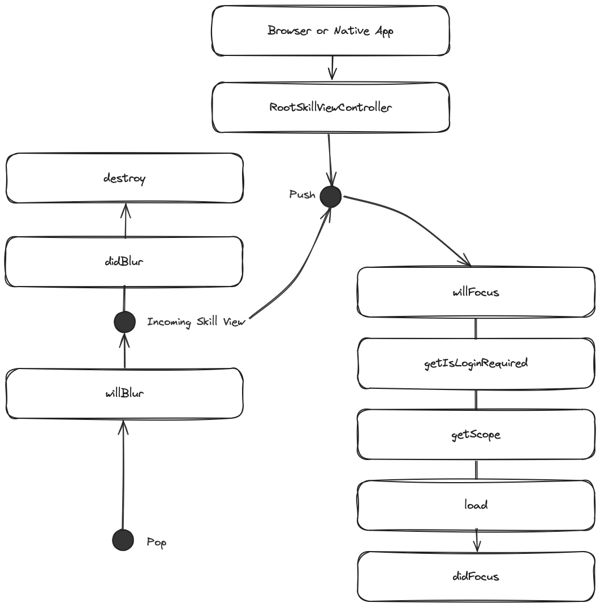

<style>
  #language-selector {
    display: flex;
    justify-content: center;
    margin-top: 20px;
  }

  #language-selector button {
    background-color: #1a1a1a;
    color: #fff;
    border: 2px solid transparent;
    border-radius: 8px;
    padding: 6px 12px; 
    margin: 0 6px; 
    cursor: pointer;
    transition: all 0.3s ease-in-out;
    font-weight: bold;
    text-transform: uppercase;
    letter-spacing: 1px;
    font-size: 0.7em; 
  }

  #language-selector button:hover, #language-selector button:focus {
    background-color: #0EDDD3;
    border-color: #0EDDD3;
    box-shadow: 0 4px 8px rgba(0, 0, 0, 0.2);
    transform: translateY(-4px);
  }

  #language-selector button:active {
    transform: translateY(2px);
    box-shadow: none;
  }
  table {
  width: 100%;
  border-collapse: collapse;
  margin-bottom: 20px;
}

th, td {
  border: 1px solid #ddd;
  padding: 8px;
  text-align: left;
}

th {
  background-color: #f2f2f2;
}

tr:nth-child(even) {
  background-color: #f9f9f9;
}
</style>


Modern iOS development primarily uses Swift, Spruce on the other hand, is a TypeScript-based framework. The following guide will help you draw parallels between familiar iOS concepts and Spruce’s architecture, and provide a clear understanding of how your existing skills can be adapted and applied in Spruce.

## Key Differences between iOS and Spruce Development

|     | iOS                      | Spruce                   |
|-----------------------|--------------------------|--------------------------|
| **Programming Language** | Swift/Objective-C        | TypeScript               |
| **IDE**                 | Xcode                    | Visual Studio Code       |
| **App Lifecycle**                 | AppDelegate                    | No Equivalent       |
| **UI Design**           | SwiftUI, ViewControllers            | Heartwood, ViewControllers |
| **Event Handling**      | Delegates, NotificationCenter, Target-Action | Mercury |
| **Data Persistence**    | Core Data, UserDefaults  | Data Stores                   |
| **Error Handling**      | NSError, Error Protocol, Try-Catch Blocks | Try-Catch Blocks, SpruceErrors |
| **Testing**             | XCTest                   | TDD by the 3 laws              |
| **User Authentication** | Apple's Frameworks, Custom Server-Side Solutions | Mercury, Authenticator |
| **User Permissions** | Apple's Frameworks, Custom Server-Side Solutions | Mercury, Authorizor |

### Programming Language

#### iOS

In iOS, SwiftUI view files declare a structure and a preview. The structure conforms to the View protocol and describes the view’s content and layout.

```swift
//
//  ContentView.swift
//  ChatPrototype
//
import SwiftUI


struct ContentView: View {
    var body: some View {
        VStack {
            Text("Knock, knock!")
                .padding()
                .background(Color.teal, in: RoundedRectangle(cornerRadius: 8))
            Text("Who's there?")
                .padding()
                .background(Color.yellow, in: RoundedRectangle(cornerRadius: 8))
        }
        .padding()
    }
}


```
#### Spruce

This `SkillViewController` will render a full screen view with a `CardViewController` on it with a title and a subtitle. All ViewControllers (and SkillViewControllers) reduce down to a `ViewModel` that return from render(). In Spruce, 100% of the styling is handled by [Heartwood](https://sprucelabsai.github.io/spruce-documentation/concepts/listeners/) ([Storybook](https://storybook.spruce.bot)). 

```typescript
import {
	AbstractSkillViewController,
	CardViewController,
	ViewControllerOptions,
	buildSkillViewLayout,
	SkillView
} from '@sprucelabs/heartwood-view-controllers'

export default class RootSkillViewController extends AbstractSkillViewController {
	public static id = 'root'
	protected cardVc: CardViewController

	public constructor(options: ViewControllerOptions) {
		super(options)

		this.cardVc = this.Controller('card', {
			header: {
				title: 'Hello, World!',
				subtitle: 'This is a card'
			}
		})
	}

	public render(): SkillView {
		return buildSkillViewLayout('grid', {
			cards: [this.cardVc.render()]
		})
	}
}

```

### IDE 

#### iOS in xcode


#### Spruce in Visual Studio Code


### App Lifecycle

#### iOS


#### Spruce

When a browser or native app loads your Skill, it will start by hitting it's `RootSkillViewController`. You can execute code at each stage by implementing a method by the name of the stage.



```
placeholder

```

### UI Design

#### iOS


```
placeholder

```

### Event Handling

```
placeholder

```

### Data Persistence

```
placeholder

```

### Error Handling

```
placeholder

```

### Testing             

```
placeholder

```

### User Authentication

```
placeholder

```

### User Permissions

```
placeholder

```