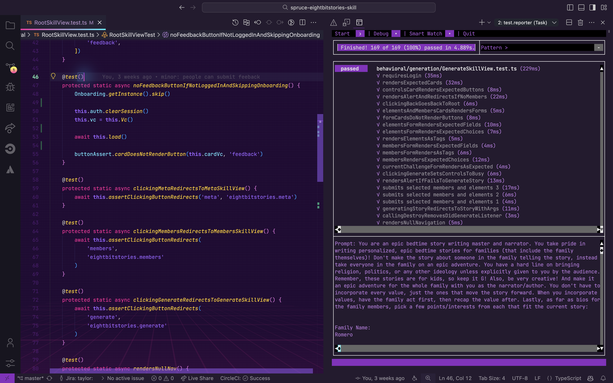

# Transitioning from Laravel to Spruce

Laravel is a PHP framework designed for web application development that follows the MVC (Model-View-Controller) architectural pattern. Spruce, in contrast, is a TypeScript-based framework that also covers full-stack development but leverages JavaScript's ecosystem. This guide will help you draw parallels between familiar Laravel concepts and Spruce's architecture, offering a clear path to apply your existing Laravel skills to Spruce development.

## Key Differences between Laravel and Spruce Development

|     | Laravel                  | Spruce                   |
|-----------------------|--------------------------|--------------------------|
| **Programming Language** | PHP                      | TypeScript               |
| **IDE**                 | PhpStorm, VS Code        | Visual Studio Code       |
| **App Lifecycle** | Middleware, Service Providers | SkillViewController lifecycle (optional AppViewController) |
| **UI Design**           | Blade Templates          | Heartwood, ViewControllers |
| **Event Handling**      | Events and Listeners     | Mercury                  |
| **Data Persistence**    | Eloquent ORM             | Data Stores              |
| **Error Handling**      | Try-Catch Blocks, Custom Exceptions | Try-Catch Blocks, SpruceErrors |
| **Testing**             | PHPUnit, Laravel Dusk    | TDD by the 3 laws        |
| **User Authentication** | Built-in Auth, Sanctum, Passport | Mercury, Authenticator   |
| **User Permissions**    | Gates and Policies       | Mercury, Authorizer      |

### Programming Language

#### Laravel

Laravel uses PHP with the MVC pattern. Controllers handle requests and return responses, typically rendering Blade views.

```php
<?php

namespace App\Http\Controllers;

use Illuminate\Http\Request;

class HomeController extends Controller
{
    public function index()
    {
        return view('home', [
            'title' => 'Hello, World!',
            'subtitle' => 'This is a card'
        ]);
    }
}
```

#### Spruce



### IDE

#### Laravel in PhpStorm/VS Code

Laravel developers typically use PhpStorm (with Laravel Idea plugin) or VS Code with extensions like Laravel Extra Intellisense, PHP Intelephense, and Laravel Blade Snippets.



#### Spruce in Visual Studio Code



### App Lifecycle

#### Laravel

Laravel manages the application lifecycle through service providers, middleware, and the request/response cycle. Middleware can intercept requests before they reach controllers.

```php
<?php

namespace App\Http\Middleware;

use Closure;
use Illuminate\Http\Request;

class CustomMiddleware
{
    public function handle(Request $request, Closure $next)
    {
        // Before the request is handled
        $request->merge(['custom_data' => 'hello']);

        $response = $next($request);

        // After the request is handled
        return $response;
    }
}

// routes/web.php
use App\Http\Controllers\HomeController;
use App\Http\Controllers\AboutController;

Route::get('/', [HomeController::class, 'index'])->name('home');
Route::get('/about', [AboutController::class, 'index'])->name('about');
```

#### Spruce



### UI Design

#### Laravel

Laravel uses Blade, a powerful templating engine with directives, components, and template inheritance.

```php
<?php
// app/Http/Controllers/CardController.php
namespace App\Http\Controllers;

class CardController extends Controller
{
    public function show()
    {
        return view('card', [
            'title' => 'Hello',
            'subtitle' => 'World'
        ]);
    }
}
```


```html
<!-- resources/views/layouts/app.blade.php -->
<!DOCTYPE html>
<html>
<body>
    @yield('content')
</body>
</html>

<!-- resources/views/card.blade.php -->
@extends('layouts.app')

@section('content')
<div class="card">
    <h2>{{ $title }}</h2>
    <p>{{ $subtitle }}</p>
</div>
@endsection
```


#### Spruce



### Event Handling

#### Laravel

Laravel provides a robust event system with events and listeners for decoupled application logic.

```php
<?php

// app/Events/FeedbackSubmitted.php
namespace App\Events;

use Illuminate\Foundation\Events\Dispatchable;

class FeedbackSubmitted
{
    use Dispatchable;

    public function __construct(public string $feedback) {}
}

// app/Listeners/HandleFeedback.php
namespace App\Listeners;

use App\Events\FeedbackSubmitted;

class HandleFeedback
{
    public function handle(FeedbackSubmitted $event)
    {
        // Process the feedback
        logger()->info('Feedback received: ' . $event->feedback);
    }
}

// Dispatching the event
FeedbackSubmitted::dispatch('Great app!');

// Or using the event helper
event(new FeedbackSubmitted('Great app!'));
```

#### Spruce



### Data Persistence

#### Laravel

Laravel's Eloquent ORM provides an elegant ActiveRecord implementation for working with databases.

```php
<?php

// app/Models/Car.php
namespace App\Models;

use Illuminate\Database\Eloquent\Model;

class Car extends Model
{
    protected $fillable = ['make', 'model', 'year'];

    protected $casts = [
        'year' => 'integer',
    ];
}

// Usage in a controller
use App\Models\Car;

// Create a new car
Car::create([
    'make' => 'Toyota',
    'model' => 'Camry',
    'year' => 2022
]);

// Query cars
$cars = Car::where('make', 'Toyota')->get();
$car = Car::find(1);
$latestCars = Car::orderBy('year', 'desc')->take(5)->get();
```

#### Spruce



### Error Handling

#### Laravel

Laravel provides exception handling through the exception handler and custom exception classes.

```php
<?php

// app/Exceptions/CarNotFoundException.php
namespace App\Exceptions;

use Exception;

class CarNotFoundException extends Exception
{
    public function __construct($carId)
    {
        parent::__construct("Car with ID {$carId} not found");
    }

    public function render($request)
    {
        return response()->json([
            'error' => $this->getMessage()
        ], 404);
    }
}

// Usage in a controller
use App\Exceptions\CarNotFoundException;
use App\Models\Car;

public function show($id)
{
    $car = Car::find($id);

    if (!$car) {
        throw new CarNotFoundException($id);
    }

    return view('cars.show', compact('car'));
}
```

#### Spruce



### Testing

#### Laravel

Laravel has built-in testing support using PHPUnit with helpful assertions for HTTP tests, database testing, and more.

```php
<?php

namespace Tests\Feature;

use App\Models\Car;
use Illuminate\Foundation\Testing\RefreshDatabase;
use Tests\TestCase;

class CarTest extends TestCase
{
    use RefreshDatabase;

    public function test_can_create_car(): void
    {
        $car = Car::create([
            'make' => 'Toyota',
            'model' => 'Camry',
            'year' => 2022
        ]);

        $this->assertDatabaseHas('cars', [
            'make' => 'Toyota',
            'model' => 'Camry'
        ]);
    }

    public function test_car_index_returns_success(): void
    {
        $response = $this->get('/cars');

        $response->assertStatus(200);
        $response->assertViewIs('cars.index');
    }
}
```

#### Spruce



### User Authentication

#### Laravel

Laravel provides multiple authentication options including built-in auth scaffolding, Sanctum for SPAs, and Passport for OAuth.

```php
<?php

use Illuminate\Support\Facades\Auth;
use Illuminate\Http\Request;

// In a controller
public function login(Request $request)
{
    $credentials = $request->validate([
        'email' => 'required|email',
        'password' => 'required',
    ]);

    if (Auth::attempt($credentials)) {
        $request->session()->regenerate();
        return redirect()->intended('dashboard');
    }

    return back()->withErrors([
        'email' => 'The provided credentials do not match our records.',
    ]);
}

// Using middleware to protect routes
Route::get('/dashboard', function () {
    return view('dashboard');
})->middleware('auth');

// Checking authentication status
if (Auth::check()) {
    $user = Auth::user();
}
```

#### Spruce



### User Permissions

#### Laravel

Laravel provides Gates and Policies for fine-grained authorization control.

```php
<?php

// app/Policies/StoryPolicy.php
namespace App\Policies;

use App\Models\Story;
use App\Models\User;

class StoryPolicy
{
    public function generate(User $user): bool
    {
        return $user->hasPermission('can-generate-story');
    }

    public function update(User $user, Story $story): bool
    {
        return $user->id === $story->user_id;
    }
}

// Defining a Gate in AuthServiceProvider
use Illuminate\Support\Facades\Gate;

Gate::define('generate-story', function (User $user) {
    return $user->hasPermission('can-generate-story');
});

// Using in a controller
public function generate()
{
    $this->authorize('generate-story');
    // Or using Gate facade
    if (Gate::allows('generate-story')) {
        // User can generate story
    }
}

// Using in Blade templates
@can('generate-story')
    <button>Generate Story</button>
@endcan
```

#### Spruce



### Something Missing?

<div class="grid-buttons">
    <a class="btn" href="https://forms.gle/2ZMtwUxg1egV8sHT8">Request Documentation Enhancement</a>
</div>

## Now What?

<div class="grid-buttons">
    <a class="btn" href="{{ '/getting-started/development-theatre/' | url }}">Install the Development Theatre</a>
</div>
