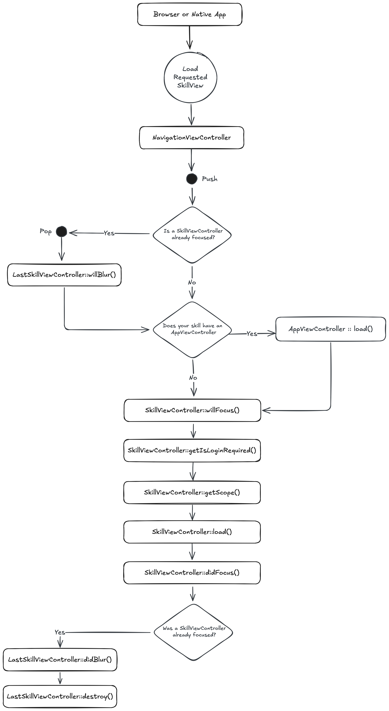

# Transitioning from Ruby on Rails to Spruce

Ruby on Rails is a full-stack web framework that emphasizes convention over configuration and developer happiness. Spruce is built on TypeScript and offers a different but equally powerful approach to building applications. This guide will help you connect your Ruby and Rails expertise to Spruce's architecture, showing how to adapt and apply your existing skills in a new environment.

## Key Differences between Ruby on Rails and Spruce Development

|     | Ruby/Rails               | Spruce                   |
|-----------------------|--------------------------|--------------------------|
| **Programming Language** | Ruby                     | TypeScript               |
| **IDE**                 | RubyMine, VS Code        | Visual Studio Code       |
| **App Lifecycle**       | Rails request cycle, before_action | AppViewController            |
| **UI Design**           | ERB templates, Rails views | Heartwood, ViewControllers |
| **Event Handling**      | ActiveSupport::Notifications, Callbacks | Mercury                  |
| **Data Persistence**    | ActiveRecord             | Data Stores              |
| **Error Handling**      | begin-rescue, Custom Exceptions | Try-Catch Blocks, SpruceErrors |
| **Testing**             | RSpec, Minitest          | TDD by the 3 laws        |
| **User Authentication** | Devise                   | Mercury, Authenticator   |
| **User Permissions**    | Pundit, CanCanCan        | Mercury, Authorizer      |

### Programming Language

#### Ruby/Rails

Ruby uses dynamic typing with an elegant, expressive syntax. Here's a simple Rails controller:

```ruby
class HomeController < ApplicationController
  def index
    @title = 'Hello, World!'
    @subtitle = 'This is a card'
  end
end

# app/views/home/index.html.erb
# <div class="card">
#   <h1><%= @title %></h1>
#   <p><%= @subtitle %></p>
# </div>
```

#### Spruce

This `SkillViewController` will render a full screen view with a `CardViewController` on it with a title and a subtitle. All ViewControllers (and SkillViewControllers) reduce down to a `ViewModel` that return from render(). In Spruce, 100% of the styling is handled by [Heartwood](../../concepts/views/) ([Storybook](https://storybook.spruce.bot)).

```typescript
import {
   AbstractSkillViewController,
   CardViewController,
   ViewControllerOptions,
   buildSkillViewLayout,
   SkillView
} from '@sprucelabs/heartwood-view-controllers'

export default class RootSkillViewController extends AbstractSkillViewController {
   public static id = 'root'
   protected cardVc: CardViewController

   public constructor(options: ViewControllerOptions) {
      super(options)

      this.cardVc = this.Controller('card', {
         header: {
         title: 'Hello, World!',
         subtitle: 'This is a card'
         }
      })
   }

   public render(): SkillView {
   return buildSkillViewLayout('grid', {
      cards: [this.cardVc.render()]
      })
   }
}
```

### IDE

#### Ruby in RubyMine/VS Code

Ruby developers typically use RubyMine for its powerful refactoring tools, or VS Code with Ruby extensions for linting, debugging, and IntelliSense.


#### Spruce in Visual Studio Code

Spruce has been fully integrated into Visual Studio Code with custom extensions, launch configs, and settings.


### App Lifecycle

#### Ruby/Rails

Rails has a well-defined request lifecycle with controllers, filters, and middleware. You can hook into various stages using callbacks.

```ruby
class ApplicationController < ActionController::Base
  before_action :authenticate_user!
  before_action :set_current_user
  after_action :log_request
  around_action :wrap_in_transaction

  private

  def set_current_user
    @current_user = current_user
  end

  def log_request
    Rails.logger.info "Request completed for #{request.path}"
  end

  def wrap_in_transaction
    ActiveRecord::Base.transaction do
      yield
    end
  end
end
```

#### Spruce

When a browser or native app loads your Skill, it will start by hitting it's `RootSkillViewController`. You can execute code at each stage by implementing a method by the name of the stage.



### UI Design

#### Ruby/Rails

Rails uses ERB (Embedded Ruby) templates for HTML rendering, with layouts and partials for reusability.

```ruby
# app/controllers/cards_controller.rb
class CardsController < ApplicationController
  def show
    @card = {
      title: 'Hello',
      subtitle: 'World'
    }
  end
end
```

```erb
<!-- app/views/cards/show.html.erb -->
<div class="card">
  <div class="card-header">
    <h2><%= @card[:title] %></h2>
  </div>
  <div class="card-body">
    <p><%= @card[:subtitle] %></p>
  </div>
</div>
```

#### Spruce

[Heartwood](../../concepts/views/) handles the rendering of all front end components. It adopts the philosphy of "Everything Beautiful". While you are constrained to the views that Heartwood provides, you can customize their look by running the following in your skill:

```shell
spruce create.theme
```

This will create a `skill.theme.ts` file you can customize. If you want to apply a theme to your organization (vs just your skill), you can utilize the [Theme Skill](https://spruce.bot/#views/theme.root).

### Event Handling

#### Ruby/Rails

Rails uses ActiveSupport::Notifications for instrumentation and pub/sub patterns, along with model callbacks for lifecycle events.

```ruby
# ActiveSupport::Notifications for pub/sub
ActiveSupport::Notifications.subscribe('user.created') do |name, start, finish, id, payload|
  puts "New user created: #{payload[:user].email}"
end

ActiveSupport::Notifications.instrument('user.created', user: @user)

# Model callbacks
class User < ApplicationRecord
  after_create :send_welcome_email
  after_save :notify_admin

  private

  def send_welcome_email
    UserMailer.welcome(self).deliver_later
  end

  def notify_admin
    AdminNotificationService.new_user(self)
  end
end
```

#### Spruce

In Spruce, your views are rendered on the edge, while your Skill is hosted on a server. So, you have to use the [Mercury event system](../../concepts/mercury/) to communicate between the two. Mercury also allows you to pass information other skills.

```typescript

// inside of Skill View sending message to the Skill with the namespace "eightbitstories"

const client = await this.connectToApi()
await this.client.emitAndFlattenResponses(
  'eightbitstories.submit-feedback::v2023_09_05',
  {
    payload: {
      feedback: 'Help make this better!',
    },
  }
)

```

### Data Persistence

#### Ruby/Rails

Rails uses ActiveRecord, a powerful ORM that follows the Active Record pattern with migrations, validations, and associations.

```ruby
# Migration
class CreateCars < ActiveRecord::Migration[7.0]
  def change
    create_table :cars do |t|
      t.string :make
      t.string :model
      t.integer :year
      t.timestamps
    end
  end
end

# Model
class Car < ApplicationRecord
  validates :make, :model, presence: true
  validates :year, numericality: { greater_than: 1900 }

  belongs_to :owner, class_name: 'User'
  has_many :service_records
end

# Usage
Car.create(make: 'Toyota', model: 'Camry', year: 2022)
Car.where(make: 'Toyota').order(year: :desc)
Car.find_by(model: 'Camry')
```

#### Spruce

In Spruce, you'll use the [Stores](../../concepts/stores/) feature to persist data. The stores use [Schemas](../../concepts/schemas/) to define the shape of the data.

```shell
spruce create.store
```

Once you configure your store, you can use it in your skill's event listener like this:

```typescript
export default async (
  event: SpruceEvent<SkillEventContract, EmitPayload>
): SpruceEventResponse<ResponsePayload> => {
  const { stores } = event

  const cars = await stores.getStore('cars')
  await cars.createOne({
    make: 'Toyota',
    model: 'Camry',
    year: 2022
  })

  return {
    success: true,
  }
}
```

### Error Handling

#### Ruby/Rails

Ruby uses begin-rescue-end blocks with custom exception classes for error handling.

```ruby
# Custom exception
class CarNotFoundError < StandardError
  attr_reader :car_id

  def initialize(car_id)
    @car_id = car_id
    super("Car not found: #{car_id}")
  end
end

# Usage
begin
  car = Car.find(car_id)
  raise CarNotFoundError.new(car_id) unless car
rescue CarNotFoundError => e
  Rails.logger.error "Error: #{e.message}"
  render json: { error: e.message }, status: :not_found
rescue ActiveRecord::RecordNotFound => e
  render json: { error: 'Record not found' }, status: :not_found
rescue StandardError => e
  Rails.logger.error "Unexpected error: #{e.message}"
  render json: { error: 'Something went wrong' }, status: :internal_server_error
end
```

#### Spruce

Spruce provides a much more robust, standardized error handling system. You can use the [SpruceError](../../concepts/errors/) class to create custom errors, you define the Schemas for those errors to give them shape, and then use try-catch blocks to handle them.

```shell
spruce create.error
```

This will create an error builder inside of your skill at `./src/errors/{{errorName}}.builder.ts`. Inside there is the schema that defines your error.

You can throw an error you have defined like this:

```typescript
throw new SpruceError({
  code: 'MY_ERRORS_NAME_HERE',
  friendlyMessage: 'All errors can provide a friendly error message!',
})
```

### Testing

#### Ruby/Rails

Ruby testing typically uses RSpec or Minitest with factory_bot for test data.

```ruby
# RSpec example
require 'rails_helper'

RSpec.describe Car, type: :model do
  describe 'validations' do
    it 'is valid with valid attributes' do
      car = Car.new(make: 'Toyota', model: 'Camry', year: 2022)
      expect(car).to be_valid
    end

    it 'is not valid without a make' do
      car = Car.new(model: 'Camry', year: 2022)
      expect(car).not_to be_valid
    end
  end

  describe '#full_name' do
    it 'returns the year, make, and model' do
      car = Car.new(make: 'Toyota', model: 'Camry', year: 2022)
      expect(car.full_name).to eq('2022 Toyota Camry')
    end
  end
end

# Minitest example
class CarTest < ActiveSupport::TestCase
  test 'should not save car without make' do
    car = Car.new(model: 'Camry', year: 2022)
    assert_not car.save
  end
end
```

#### Spruce

Everything in Spruce starts with a [Test](../../concepts/tests/) If you want to write a piece of production code, you must start with a failing test.

```shell
spruce create.test
```

Once your test file is created, you are ready to start!

### User Authentication

#### Ruby/Rails

Rails developers commonly use Devise for authentication, which provides a complete solution out of the box.

```ruby
# Gemfile
gem 'devise'

# User model
class User < ApplicationRecord
  devise :database_authenticatable, :registerable,
         :recoverable, :rememberable, :validatable
end

# Controller
class ApplicationController < ActionController::Base
  before_action :authenticate_user!

  def current_user
    @current_user ||= super
  end
end

# In views
<% if user_signed_in? %>
  <p>Welcome, <%= current_user.email %></p>
  <%= link_to 'Sign Out', destroy_user_session_path, method: :delete %>
<% else %>
  <%= link_to 'Sign In', new_user_session_path %>
<% end %>
```

#### Spruce

Because [Mercury](../../concepts/mercury/) handles user authentication (and authorization). You can use the [Authenticator](../../concepts/permissions/) to know if a person is logged in or not. You can also use it to log a person in or out.

```typescript
//inside your Skill View's load lifecycle method
public async load(options: SkillViewControllerLoadOptions) {
  const { authenticator } = options

  this.log.info(authenticator.isLoggedIn())
  this.log.info(authenticator.getPerson())

  // force person to be logged out
  authenticator.clearSession()

}
```

### User Permissions

#### Ruby/Rails

Rails apps commonly use Pundit or CanCanCan for authorization and permission management.

```ruby
# Pundit policy
class StoryPolicy < ApplicationPolicy
  def generate?
    user.admin? || user.has_permission?(:can_generate_story)
  end

  def edit?
    user.admin? || record.author == user
  end
end

# Controller
class StoriesController < ApplicationController
  def generate
    authorize Story
    # Generate story logic
  end
end

# CanCanCan ability
class Ability
  include CanCan::Ability

  def initialize(user)
    if user.admin?
      can :manage, :all
    else
      can :read, Story
      can :generate, Story if user.has_role?(:author)
      can :update, Story, author_id: user.id
    end
  end
end

# Controller with CanCanCan
class StoriesController < ApplicationController
  load_and_authorize_resource

  def generate
    # Only accessible if user can :generate, Story
  end
end
```

#### Spruce

Mercury also handles all your [Permission](../../concepts/permissions/) needs. To introduce new permissions into the platform, you need to create a Permission Contract in your skill:

```shell
spruce create.permissions
```

Then you can do permission checks in your Skill View like this:

```typescript
//inside your Skill View's load lifecycle method
public async load(options: SkillViewControllerLoadOptions) {
  const { authorizer } = options

  const canGenerateStory = await authorizer.can({
    contractId: 'eightbitstories.eight-bit-stories',
    permissionIds: ['can-generate-story'],
  })

}
```

### Something Missing?

<div class="grid-buttons">
    <a class="btn" href="https://forms.gle/2ZMtwUxg1egV8sHT8">Request Documentation Enhancement</a>
</div>

## Now What?

<div class="grid-buttons">
    <a class="btn" href="{{ '/getting-started/development-theatre/' | url }}">Install the Development Theatre</a>
</div>
