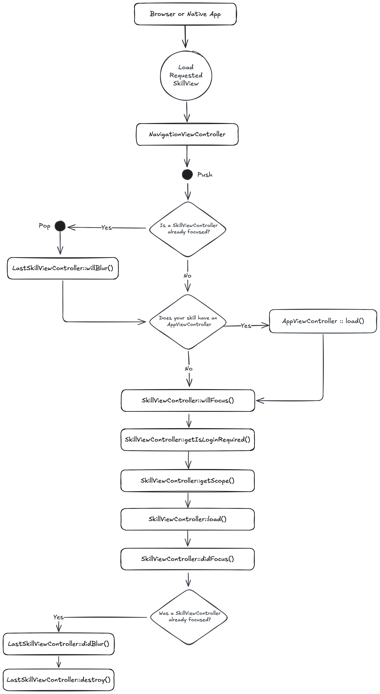

# Transitioning from Spring Boot to Spruce

Spring Boot is a powerful Java framework that simplifies the development of enterprise-grade applications by providing auto-configuration, embedded servers, and production-ready features out of the box. Spruce is a TypeScript-based framework designed for building scalable, event-driven applications. This guide will help Spring Boot developers understand how to transition their skills to work with Spruce.

## Key Differences between Spring Boot and Spruce Development

|     | Spring Boot              | Spruce                   |
|-----------------------|--------------------------|--------------------------|
| **Programming Language** | Java                    | TypeScript               |
| **IDE**                 | IntelliJ IDEA, Eclipse, STS | Visual Studio Code       |
| **App Lifecycle**       | Spring Container, Beans | SkillViewController            |
| **UI Design**           | Thymeleaf, REST Controllers | Heartwood, ViewControllers |
| **Event Handling**      | ApplicationEvents, @EventListener | Mercury                  |
| **Data Persistence**    | Spring Data JPA         | Data Stores              |
| **Error Handling**      | @ExceptionHandler, try-catch | Try-Catch Blocks, SpruceErrors |
| **Testing**             | JUnit, MockMvc, @SpringBootTest | TDD by the 3 laws        |
| **User Authentication** | Spring Security         | Mercury, Authenticator   |
| **User Permissions**    | Spring Security Authorities | Mercury, Authorizer      |

### Programming Language

#### Spring Boot

Spring Boot uses Java with annotations for configuration. Controllers handle HTTP requests and return responses or views.

```java
// HelloController.java
package com.example.demo.controller;

import org.springframework.stereotype.Controller;
import org.springframework.ui.Model;
import org.springframework.web.bind.annotation.GetMapping;

@Controller
public class HelloController {

    @GetMapping("/")
    public String home(Model model) {
        model.addAttribute("title", "Hello, World!");
        model.addAttribute("subtitle", "This is a card");
        return "home";
    }
}
```

#### Spruce

This `SkillViewController` will render a full screen view with a `CardViewController` on it with a title and a subtitle. All ViewControllers (and SkillViewControllers) reduce down to a `ViewModel` that return from render(). In Spruce, 100% of the styling is handled by [Heartwood](../../concepts/views/) ([Storybook](https://storybook.spruce.bot)).

```typescript
import {
   AbstractSkillViewController,
   CardViewController,
   ViewControllerOptions,
   buildSkillViewLayout,
   SkillView
} from '@sprucelabs/heartwood-view-controllers'

export default class RootSkillViewController extends AbstractSkillViewController {
   public static id = 'root'
   protected cardVc: CardViewController

   public constructor(options: ViewControllerOptions) {
      super(options)

      this.cardVc = this.Controller('card', {
         header: {
         title: 'Hello, World!',
         subtitle: 'This is a card'
         }
      })
   }

   public render(): SkillView {
   return buildSkillViewLayout('grid', {
      cards: [this.cardVc.render()]
      })
   }
}
```

### IDE

#### Spring Boot in IntelliJ IDEA

Spring Boot developers typically use IntelliJ IDEA (with Spring support), Eclipse with Spring Tool Suite (STS), or VS Code with Java extensions. IntelliJ provides excellent support for Spring annotations, auto-configuration, and bean management.


#### Spruce in Visual Studio Code

Spruce has been fully integrated into Visual Studio Code with custom extensions, launch configs, and settings.


### App Lifecycle

#### Spring Boot

Spring Boot manages application lifecycle through the Spring IoC container, beans, and lifecycle callbacks. Components are discovered via component scanning and managed by the container.

```java
// Application.java
package com.example.demo;

import org.springframework.boot.SpringApplication;
import org.springframework.boot.autoconfigure.SpringBootApplication;
import org.springframework.boot.context.event.ApplicationReadyEvent;
import org.springframework.context.event.EventListener;
import javax.annotation.PostConstruct;
import javax.annotation.PreDestroy;

@SpringBootApplication
public class DemoApplication {

    public static void main(String[] args) {
        SpringApplication.run(DemoApplication.class, args);
    }

    @PostConstruct
    public void onStartup() {
        System.out.println("Application starting up...");
    }

    @EventListener(ApplicationReadyEvent.class)
    public void onReady() {
        System.out.println("Application is ready!");
    }

    @PreDestroy
    public void onShutdown() {
        System.out.println("Application shutting down...");
    }
}
```

#### Spruce

When a browser or native app loads your Skill, it will start by hitting it's `RootSkillViewController`. You can execute code at each stage by implementing a method by the name of the stage.



### UI Design

#### Spring Boot

Spring Boot commonly uses Thymeleaf for server-side rendering or REST controllers for API responses consumed by frontend frameworks.

```java
// CardController.java
@Controller
public class CardController {

    @GetMapping("/card")
    public String showCard(Model model) {
        model.addAttribute("title", "Hello");
        model.addAttribute("subtitle", "World");
        return "card";
    }
}

// REST API alternative
@RestController
@RequestMapping("/api")
public class CardRestController {

    @GetMapping("/card")
    public Map<String, String> getCard() {
        return Map.of(
            "title", "Hello",
            "subtitle", "World"
        );
    }
}
```

```html
<!-- templates/card.html (Thymeleaf) -->
<!DOCTYPE html>
<html xmlns:th="http://www.thymeleaf.org">
<body>
    <div class="card">
        <h2 th:text="${title}">Title</h2>
        <p th:text="${subtitle}">Subtitle</p>
    </div>
</body>
</html>
```

#### Spruce

[Heartwood](../../concepts/views/) handles the rendering of all front end components. It adopts the philosphy of "Everything Beautiful". While you are constrained to the views that Heartwood provides, you can customize their look by running the following in your skill:

```shell
spruce create.theme
```

This will create a `skill.theme.ts` file you can customize. If you want to apply a theme to your organization (vs just your skill), you can utilize the [Theme Skill](https://spruce.bot/#views/theme.root).

### Event Handling

#### Spring Boot

Spring Boot uses ApplicationEvents and the @EventListener annotation for decoupled event-driven communication between components.

```java
// Custom Event
public class FeedbackSubmittedEvent extends ApplicationEvent {
    private final String feedback;

    public FeedbackSubmittedEvent(Object source, String feedback) {
        super(source);
        this.feedback = feedback;
    }

    public String getFeedback() {
        return feedback;
    }
}

// Event Publisher
@Service
public class FeedbackService {

    @Autowired
    private ApplicationEventPublisher eventPublisher;

    public void submitFeedback(String feedback) {
        eventPublisher.publishEvent(
            new FeedbackSubmittedEvent(this, feedback)
        );
    }
}

// Event Listener
@Component
public class FeedbackEventListener {

    @EventListener
    public void handleFeedback(FeedbackSubmittedEvent event) {
        System.out.println("Feedback received: " + event.getFeedback());
    }

    @Async
    @EventListener
    public void handleFeedbackAsync(FeedbackSubmittedEvent event) {
        // Handle asynchronously
    }
}
```

#### Spruce

In Spruce, your views are rendered on the edge, while your Skill is hosted on a server. So, you have to use the [Mercury event system](../../concepts/mercury/) to communicate between the two. Mercury also allows you to pass information other skills.

```typescript

// inside of Skill View sending message to the Skill with the namespace "eightbitstories"

const client = await this.connectToApi()
await this.client.emitAndFlattenResponses(
  'eightbitstories.submit-feedback::v2023_09_05',
  {
    payload: {
      feedback: 'Help make this better!',
    },
  }
)

```

### Data Persistence

#### Spring Boot

Spring Data JPA provides a powerful abstraction over JPA/Hibernate with repository interfaces and entity mapping.

```java
// Entity
@Entity
@Table(name = "cars")
public class Car {

    @Id
    @GeneratedValue(strategy = GenerationType.IDENTITY)
    private Long id;

    @Column(nullable = false)
    private String make;

    @Column(nullable = false)
    private String model;

    @Column(nullable = false)
    private Integer year;

    // Getters, setters, constructors...
}

// Repository
@Repository
public interface CarRepository extends JpaRepository<Car, Long> {
    List<Car> findByMake(String make);
    List<Car> findByYearGreaterThan(Integer year);
}

// Service
@Service
public class CarService {

    @Autowired
    private CarRepository carRepository;

    public Car createCar(String make, String model, Integer year) {
        Car car = new Car(make, model, year);
        return carRepository.save(car);
    }

    public List<Car> findByMake(String make) {
        return carRepository.findByMake(make);
    }
}
```

#### Spruce

In Spruce, you'll use the [Stores](../../concepts/stores/) feature to persist data. The stores use [Schemas](../../concepts/schemas/) to define the shape of the data.

```shell
spruce create.store
```

Once you configure your store, you can use it in your skill's event listener like this:

```typescript
export default async (
  event: SpruceEvent<SkillEventContract, EmitPayload>
): SpruceEventResponse<ResponsePayload> => {
  const { stores } = event

  const cars = await stores.getStore('cars')
  await cars.createOne({
    make: 'Toyota',
    model: 'Camry',
    year: 2022
  })

  return {
    success: true,
  }
}
```

### Error Handling

#### Spring Boot

Spring Boot provides multiple ways to handle errors including @ExceptionHandler, @ControllerAdvice, and ResponseStatusException.

```java
// Custom Exception
public class CarNotFoundException extends RuntimeException {
    public CarNotFoundException(Long id) {
        super("Car not found with id: " + id);
    }
}

// Global Exception Handler
@ControllerAdvice
public class GlobalExceptionHandler {

    @ExceptionHandler(CarNotFoundException.class)
    public ResponseEntity<ErrorResponse> handleCarNotFound(
            CarNotFoundException ex) {
        ErrorResponse error = new ErrorResponse(
            "CAR_NOT_FOUND",
            ex.getMessage()
        );
        return ResponseEntity.status(HttpStatus.NOT_FOUND).body(error);
    }

    @ExceptionHandler(Exception.class)
    public ResponseEntity<ErrorResponse> handleGeneral(Exception ex) {
        ErrorResponse error = new ErrorResponse(
            "INTERNAL_ERROR",
            "An unexpected error occurred"
        );
        return ResponseEntity.status(HttpStatus.INTERNAL_SERVER_ERROR)
            .body(error);
    }
}

// In Controller
@GetMapping("/cars/{id}")
public Car getCar(@PathVariable Long id) {
    return carRepository.findById(id)
        .orElseThrow(() -> new CarNotFoundException(id));
}
```

#### Spruce

Spruce provides a much more robust, standardized error handling system. You can use the [SpruceError](../../concepts/errors/) class to create custom errors, you define the Schemas for those errors to give them shape, and then use try-catch blocks to handle them.

```shell
spruce create.error
```

This will create an error builder inside of your skill at `./src/errors/{{errorName}}.builder.ts`. Inside there is the schema that defines your error.

You can throw an error you have defined like this:

```typescript
throw new SpruceError({
  code: 'CAR_NOT_FOUND',
  carId: id,
  friendlyMessage: 'The requested car could not be found.',
})
```

### Testing

#### Spring Boot

Spring Boot provides comprehensive testing support with @SpringBootTest, MockMvc for web layer testing, and integration with JUnit 5.

```java
// Unit Test
@ExtendWith(MockitoExtension.class)
class CarServiceTest {

    @Mock
    private CarRepository carRepository;

    @InjectMocks
    private CarService carService;

    @Test
    void shouldCreateCar() {
        Car car = new Car("Toyota", "Camry", 2022);
        when(carRepository.save(any(Car.class))).thenReturn(car);

        Car result = carService.createCar("Toyota", "Camry", 2022);

        assertEquals("Toyota", result.getMake());
        verify(carRepository).save(any(Car.class));
    }
}

// Integration Test
@SpringBootTest
@AutoConfigureMockMvc
class CarControllerTest {

    @Autowired
    private MockMvc mockMvc;

    @Test
    void shouldReturnCars() throws Exception {
        mockMvc.perform(get("/api/cars"))
            .andExpect(status().isOk())
            .andExpect(jsonPath("$").isArray());
    }

    @Test
    void shouldCreateCar() throws Exception {
        String carJson = "{\"make\":\"Toyota\",\"model\":\"Camry\",\"year\":2022}";

        mockMvc.perform(post("/api/cars")
            .contentType(MediaType.APPLICATION_JSON)
            .content(carJson))
            .andExpect(status().isCreated())
            .andExpect(jsonPath("$.make").value("Toyota"));
    }
}
```

#### Spruce

Everything in Spruce starts with a [Test](../../concepts/tests/) If you want to write a piece of production code, you must start with a failing test.

```shell
spruce create.test
```

Once your test file is created, you are ready to start!

### User Authentication

#### Spring Boot

Spring Security provides comprehensive authentication support with multiple strategies including form login, OAuth2, and JWT.

```java
// Security Configuration
@Configuration
@EnableWebSecurity
public class SecurityConfig {

    @Bean
    public SecurityFilterChain filterChain(HttpSecurity http) throws Exception {
        http
            .authorizeHttpRequests(auth -> auth
                .requestMatchers("/public/**").permitAll()
                .requestMatchers("/dashboard/**").authenticated()
                .anyRequest().authenticated()
            )
            .formLogin(form -> form
                .loginPage("/login")
                .defaultSuccessUrl("/dashboard")
                .permitAll()
            )
            .logout(logout -> logout
                .logoutSuccessUrl("/login?logout")
                .permitAll()
            );
        return http.build();
    }

    @Bean
    public UserDetailsService userDetailsService() {
        // Custom user details service implementation
        return new CustomUserDetailsService();
    }
}

// Accessing authenticated user
@GetMapping("/dashboard")
public String dashboard(@AuthenticationPrincipal UserDetails user, Model model) {
    model.addAttribute("username", user.getUsername());
    return "dashboard";
}
```

#### Spruce

Because [Mercury](../../concepts/mercury/) handles user authentication (and authorization). You can use the [Authenticator](../../concepts/permissions/) to know if a person is logged in or not. You can also use it to log a person in or out.

```typescript
//inside your Skill View's load lifecycle method
public async load(options: SkillViewControllerLoadOptions) {
  const { authenticator } = options

  this.log.info(authenticator.isLoggedIn())
  this.log.info(authenticator.getPerson())

  // force person to be logged out
  authenticator.clearSession()

}
```

### User Permissions

#### Spring Boot

Spring Security provides method-level security with @PreAuthorize, @Secured, and role-based access control.

```java
// Enable method security
@Configuration
@EnableMethodSecurity
public class MethodSecurityConfig {
}

// Service with method-level security
@Service
public class StoryService {

    @PreAuthorize("hasAuthority('STORY_GENERATE')")
    public Story generateStory(StoryRequest request) {
        // Only users with STORY_GENERATE authority can access
        return new Story(request);
    }

    @PreAuthorize("hasRole('ADMIN') or hasAuthority('STORY_DELETE')")
    public void deleteStory(Long storyId) {
        // Requires ADMIN role or STORY_DELETE authority
    }

    @PreAuthorize("#userId == authentication.principal.id")
    public List<Story> getUserStories(Long userId) {
        // Only the user themselves can access their stories
        return storyRepository.findByUserId(userId);
    }
}

// Controller with role check
@GetMapping("/admin/stories")
@PreAuthorize("hasRole('ADMIN')")
public List<Story> getAllStories() {
    return storyService.findAll();
}
```

#### Spruce

Mercury also handles all your [Permission](../../concepts/permissions/) needs. To introduce new permissions into the platform, you need to create a Permission Contract in your skill:

```shell
spruce create.permissions
```

Then you can do permission checks in your Skill View like this:

```typescript
//inside your Skill View's load lifecycle method
public async load(options: SkillViewControllerLoadOptions) {
  const { authorizer } = options

  const canGenerateStory = await authorizer.can({
    contractId: 'eightbitstories.eight-bit-stories',
    permissionIds: ['can-generate-story'],
  })

}
```

### Something Missing?

<div class="grid-buttons">
    <a class="btn" href="https://forms.gle/2ZMtwUxg1egV8sHT8">Request Documentation Enhancement</a>
</div>

## Now What?

<div class="grid-buttons">
    <a class="btn" href="{{ '/getting-started/development-theatre/' | url }}">Install the Development Theatre</a>
</div>
